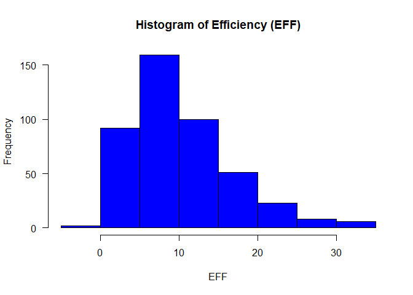
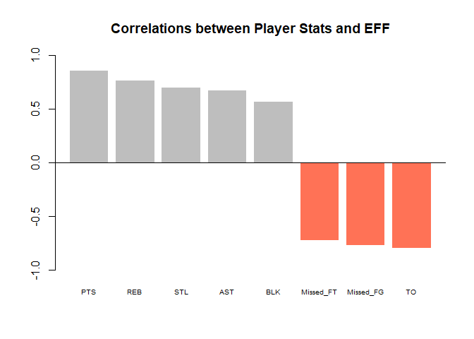
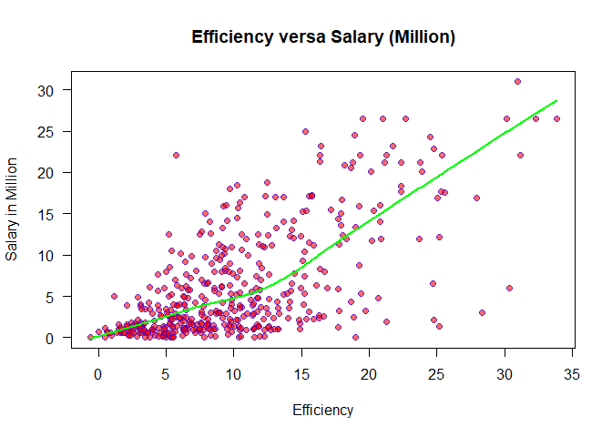
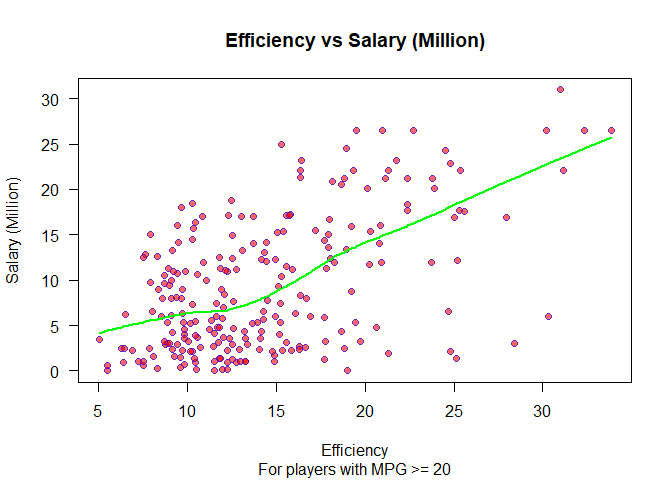

hw02-Tianshu-Zhao
================
Tianshu Zhao
2017.10.1

Download the data

``` r
# download csv file to your working directory
# (do NOT include this code in your Rmd)
setwd('C:/Users/ariel/Desktop')
github <- "https://github.com/ucb-stat133/stat133-fall-2017/raw/master/"
file <- "data/nba2017-player-statistics.csv"
csv <- paste0(github, file)
download.file(url = csv, destfile = 'nba2017-player-statistics.csv')
```

***Question 1*** Create a data dictionary

See the file 'nba2017-player-statistics-dictionary.md' in the 'data' folder in the 'hw02' dictorary.

***Question 2***\_

Part I

``` r
# read data as a format of  read.csv( ), and use str( ) to display its structure
data <- read.csv('C:/Users/ariel/Desktop/nba2017-player-statistics.csv',
        colClasses = c('character',
                       'character',
                       'factor',
                       'character',
                       'numeric',
                       rep('integer',19)))
data
```

    ##                       Player Team Position Experience   Salary Rank Age GP
    ## 1                 Al Horford  BOS        C          9 26540100    4  30 68
    ## 2               Amir Johnson  BOS       PF         11 12000000    6  29 80
    ## 3              Avery Bradley  BOS       SG          6  8269663    5  26 55
    ## 4          Demetrius Jackson  BOS       PG          R  1450000   15  22  5
    ## 5               Gerald Green  BOS       SF          9  1410598   11  31 47
    ## 6              Isaiah Thomas  BOS       PG          5  6587132    1  27 76
    ## 7                Jae Crowder  BOS       SF          4  6286408    3  26 72
    ## 8                James Young  BOS       SG          2  1825200   13  21 29
    ## 9               Jaylen Brown  BOS       SF          R  4743000    8  20 78
    ## 10             Jonas Jerebko  BOS       PF          6  5000000   10  29 78
    ## 11             Jordan Mickey  BOS       PF          1  1223653   14  22 25
    ## 12              Kelly Olynyk  BOS        C          3  3094014    7  25 75
    ## 13              Marcus Smart  BOS       SG          2  3578880    2  22 79
    ## 14              Terry Rozier  BOS       PG          1  1906440    9  22 74
    ## 15              Tyler Zeller  BOS        C          4  8000000   12  27 51
    ## 16             Channing Frye  CLE        C         10  7806971    7  33 74
    ## 17             Dahntay Jones  CLE       SF         12    18255   20  36  1
    ## 18            Deron Williams  CLE       PG         11   259626   11  32 24
    ## 19          Derrick Williams  CLE       PF          5   268029   12  25 25
    ## 20               Edy Tavares  CLE        C          1     5145   18  24  1
    ## 21             Iman Shumpert  CLE       SG          5  9700000    4  26 76
    ## 22                J.R. Smith  CLE       SG         12 12800000    8  31 41
    ## 23               James Jones  CLE       SF         13  1551659   15  36 48
    ## 24                Kay Felder  CLE       PG          R   543471   13  21 42
    ## 25                Kevin Love  CLE       PF          8 21165675    5  28 60
    ## 26               Kyle Korver  CLE       SG         13  5239437    9  35 35
    ## 27              Kyrie Irving  CLE       PG          5 17638063    2  24 72
    ## 28              LeBron James  CLE       SF         13 30963450    1  32 74
    ## 29         Richard Jefferson  CLE       SF         15  2500000    6  36 79
    ## 30          Tristan Thompson  CLE        C          5 15330435    3  25 78
    ## 31             Bruno Caboclo  TOR       SF          2  1589640   17  21  9
    ## 32               Cory Joseph  TOR       SG          5  7330000    4  25 80
    ## 33              Delon Wright  TOR       PG          1  1577280   14  24 27
    ## 34             DeMar DeRozan  TOR       SG          7 26540100    1  27 74
    ## 35           DeMarre Carroll  TOR       SF          7 14200000    5  30 72
    ## 36             Fred VanVleet  TOR       PG          R   543471   15  22 37
    ## 37              Jakob Poeltl  TOR        C          R  2703960   12  21 54
    ## 38         Jonas Valanciunas  TOR        C          4 14382022    3  24 80
    ## 39                Kyle Lowry  TOR       PG         10 12000000    2  30 60
    ## 40            Lucas Nogueira  TOR        C          2  1921320    9  24 57
    ## 41             Norman Powell  TOR       SG          1   874636    7  23 76
    ## 42               P.J. Tucker  TOR       SF          5  5300000   13  31 24
    ## 43             Pascal Siakam  TOR       PF          R  1196040   10  22 55
    ## 44         Patrick Patterson  TOR       PF          6  6050000    6  27 65
    ## 45               Serge Ibaka  TOR       PF          7 12250000   11  27 23
    ## 46          Bojan Bogdanovic  WAS       SF          2  3730653   10  27 26
    ## 47              Bradley Beal  WAS       SG          4 22116750    2  23 77
    ## 48          Brandon Jennings  WAS       PG          7  1200000   13  27 23
    ## 49          Chris McCullough  WAS       PF          1  1191480   17  21  2
    ## 50             Daniel Ochefu  WAS        C          R   543471   16  23 19
    ## 51               Ian Mahinmi  WAS        C          8 15944154   12  30 31
    ## 52               Jason Smith  WAS        C          8  5000000    7  30 74
    ## 53                 John Wall  WAS       PG          6 16957900    1  26 78
    ## 54             Marcin Gortat  WAS        C          9 12000000    4  32 82
    ## 55           Markieff Morris  WAS       PF          5  7400000    5  27 76
    ## 56               Otto Porter  WAS       SF          3  5893981    3  23 80
    ## 57         Sheldon McClellan  WAS       SG          R   543471   14  24 30
    ## 58          Tomas Satoransky  WAS       SG          R  2870813    8  25 57
    ## 59                Trey Burke  WAS       PG          3  3386598    9  24 57
    ## 60           DeAndre' Bembry  ATL       SF          R  1499760   14  22 38
    ## 61           Dennis Schroder  ATL       PG          3  2708582    1  23 79
    ## 62             Dwight Howard  ATL        C         12 23180275    3  31 74
    ## 63            Ersan Ilyasova  ATL       PF          8  8400000   12  29 26
    ## 64             Jose Calderon  ATL       PG         11   392478   15  35 17
    ## 65             Kent Bazemore  ATL       SF          4 15730338    5  27 73
    ## 66            Kris Humphries  ATL       PF         12  4000000   11  31 56
    ## 67           Malcolm Delaney  ATL       PG          R  2500000    7  27 73
    ## 68             Mike Dunleavy  ATL       SF         14  4837500   13  36 30
    ## 69              Mike Muscala  ATL        C          3  1015696    8  25 70
    ## 70              Paul Millsap  ATL       PF         10 20072033    2  31 69
    ## 71                Ryan Kelly  ATL       PF          3   418228   17  25 16
    ## 72           Thabo Sefolosha  ATL       SF         10  3850000    6  32 62
    ## 73              Tim Hardaway  ATL       SG          3  2281605    4  24 79
    ## 74     Giannis Antetokounmpo  MIL       SF          3  2995421    1  22 80
    ## 75               Greg Monroe  MIL        C          6 17100000    5  26 81
    ## 76             Jabari Parker  MIL       PF          2  5374320    6  21 51
    ## 77               Jason Terry  MIL       SG         17  1551659    7  39 74
    ## 78               John Henson  MIL        C          4 12517606    9  26 58
    ## 79           Khris Middleton  MIL       SF          4 15200000   11  25 29
    ## 80           Malcolm Brogdon  MIL       SG          R   925000    4  24 75
    ## 81       Matthew Dellavedova  MIL       PG          3  9607500    3  26 76
    ## 82           Michael Beasley  MIL       PF          8  1403611   10  28 56
    ## 83           Mirza Teletovic  MIL       PF          4 10500000    8  31 70
    ## 84             Rashad Vaughn  MIL       SG          1  1811040   13  20 41
    ## 85             Spencer Hawes  MIL       PF          9  6348759   15  28 19
    ## 86                Thon Maker  MIL        C          R  2568600   12  19 57
    ## 87                Tony Snell  MIL       SG          3  2368327    2  25 80
    ## 88              Aaron Brooks  IND       PG          8  2700000    9  32 65
    ## 89              Al Jefferson  IND        C         12 10230179    8  32 66
    ## 90                C.J. Miles  IND       SF         11  4583450    6  29 76
    ## 91             Georges Niang  IND       PF          R   650000   16  23 23
    ## 92               Jeff Teague  IND       PG          7  8800000    2  28 82
    ## 93                 Joe Young  IND       PG          1  1052342   14  24 33
    ## 94            Kevin Seraphin  IND       PF          6  1800000   12  27 49
    ## 95          Lance Stephenson  IND       SG          6  4000000   15  26  6
    ## 96               Lavoy Allen  IND       PF          5  4000000   10  27 61
    ## 97               Monta Ellis  IND       SG         11 10770000    5  31 74
    ## 98              Myles Turner  IND        C          1  2463840    3  20 81
    ## 99               Paul George  IND       SF          6 18314532    1  26 75
    ## 100         Rakeem Christmas  IND       PF          1  1052342   13  25 29
    ## 101           Thaddeus Young  IND       PF          9 14153652    4  28 74
    ## 102           Anthony Morrow  CHI       SG          8  3488000   17  31  9
    ## 103             Bobby Portis  CHI       PF          1  1453680   10  21 64
    ## 104            Cameron Payne  CHI       PG          1  2112480   16  22 11
    ## 105        Cristiano Felicio  CHI        C          1   874636    8  24 66
    ## 106         Denzel Valentine  CHI       SG          R  2092200   11  23 57
    ## 107              Dwyane Wade  CHI       SG         13 23200000    4  35 60
    ## 108            Isaiah Canaan  CHI       SG          3  1015696   14  25 39
    ## 109             Jerian Grant  CHI       PG          1  1643040    9  24 63
    ## 110             Jimmy Butler  CHI       SF          5 17552209    1  27 76
    ## 111        Joffrey Lauvergne  CHI        C          2  1709720   15  25 20
    ## 112  Michael Carter-Williams  CHI       PG          3  3183526   12  25 45
    ## 113           Nikola Mirotic  CHI       PF          2  5782450    5  25 70
    ## 114              Paul Zipser  CHI       SF          R   750000   13  22 44
    ## 115              Rajon Rondo  CHI       PG         10 14000000    3  30 69
    ## 116              Robin Lopez  CHI        C          8 13219250    2  28 81
    ## 117             Dion Waiters  MIA       SG          4  2898000    8  25 46
    ## 118             Goran Dragic  MIA       PG          8 15890000    2  30 73
    ## 119         Hassan Whiteside  MIA        C          4 22116750    1  27 77
    ## 120            James Johnson  MIA       PF          7  4000000    4  29 76
    ## 121           Josh McRoberts  MIA       PF          9  5782450   13  29 22
    ## 122          Josh Richardson  MIA       SG          1   874636    6  23 53
    ## 123          Justise Winslow  MIA       SF          1  2593440   11  20 18
    ## 124             Luke Babbitt  MIA       SF          6  1227000    9  27 68
    ## 125              Okaro White  MIA       PF          R   210995   12  24 35
    ## 126          Rodney McGruder  MIA       SG          R   543471    5  25 78
    ## 127            Tyler Johnson  MIA       PG          2  5628000    3  24 73
    ## 128            Udonis Haslem  MIA        C         13  4000000   15  36 17
    ## 129          Wayne Ellington  MIA       SG          7  6000000    7  29 62
    ## 130              Willie Reed  MIA        C          1  1015696   10  26 71
    ## 131           Andre Drummond  DET        C          4 22116750    4  23 81
    ## 132              Aron Baynes  DET        C          4  6500000    9  30 75
    ## 133               Beno Udrih  DET       PG         12  1551659   10  34 39
    ## 134         Boban Marjanovic  DET        C          1  7000000   13  28 35
    ## 135          Darrun Hilliard  DET       SG          1   874060   12  23 39
    ## 136           Henry Ellenson  DET       PF          R  1704120   14  20 19
    ## 137                Ish Smith  DET       PG          6  6000000    5  28 81
    ## 138                Jon Leuer  DET       PF          5 10991957    6  27 75
    ## 139 Kentavious Caldwell-Pope  DET       SG          3  3678319    3  23 76
    ## 140            Marcus Morris  DET       SF          5  4625000    2  27 79
    ## 141          Michael Gbinije  DET       SG          R   650000   15  24  9
    ## 142           Reggie Bullock  DET       SF          3  2255644   11  25 31
    ## 143           Reggie Jackson  DET       PG          5 14956522    7  26 52
    ## 144          Stanley Johnson  DET       SF          1  2969880    8  20 77
    ## 145            Tobias Harris  DET       PF          5 17200000    1  24 82
    ## 146            Brian Roberts  CHO       PG          4  1050961   12  31 41
    ## 147            Briante Weber  CHO       PG          1   102898   15  24 13
    ## 148           Christian Wood  CHO       PF          1   874636   16  21 13
    ## 149              Cody Zeller  CHO       PF          3  5318313    7  24 62
    ## 150           Frank Kaminsky  CHO        C          1  2730000    5  23 75
    ## 151              Jeremy Lamb  CHO       SG          4  6511628    8  24 62
    ## 152          Johnny O'Bryant  CHO       PF          2   161483   17  23  4
    ## 153             Kemba Walker  CHO       PG          5 12000000    1  26 79
    ## 154          Marco Belinelli  CHO       SG          9  6333333    6  30 74
    ## 155          Marvin Williams  CHO       PF         11 12250000    4  30 76
    ## 156   Michael Kidd-Gilchrist  CHO       SF          4 13000000    3  23 81
    ## 157            Miles Plumlee  CHO        C          4 12500000   14  28 13
    ## 158            Nicolas Batum  CHO       SG          8 20869566    2  28 77
    ## 159           Ramon Sessions  CHO       PG          9  6000000    9  30 50
    ## 160           Treveon Graham  CHO       SG          R   543471   13  23 27
    ## 161          Carmelo Anthony  NYK       SF         13 24559380    1  32 74
    ## 162           Chasson Randle  NYK       PG          R   143860   15  23 18
    ## 163             Courtney Lee  NYK       SG          8 11242000    2  31 77
    ## 164             Derrick Rose  NYK       PG          7 21323250    4  28 64
    ## 165              Joakim Noah  NYK        C          9 17000000   10  31 46
    ## 166           Justin Holiday  NYK       SG          3  1015696    5  27 82
    ## 167       Kristaps Porzingis  NYK       PF          1  4317720    3  21 66
    ## 168             Kyle O'Quinn  NYK        C          4  3900000    8  26 79
    ## 169             Lance Thomas  NYK       PF          5  6191000   11  28 46
    ## 170         Marshall Plumlee  NYK        C          R   543471   16  24 21
    ## 171            Maurice Ndour  NYK       PF          R   543471   14  24 32
    ## 172     Mindaugas Kuzminskas  NYK       SF          R  2898000    9  27 68
    ## 173                Ron Baker  NYK       SG          R   543471   12  23 52
    ## 174            Sasha Vujacic  NYK       SG          9  1410598   13  32 42
    ## 175        Willy Hernangomez  NYK        C          R  1375000    7  22 72
    ## 176             Aaron Gordon  ORL       SF          2  4351320    2  21 80
    ## 177          Bismack Biyombo  ORL        C          5 17000000    5  24 81
    ## 178              C.J. Watson  ORL       PG          9  5000000    9  32 62
    ## 179            D.J. Augustin  ORL       PG          8  7250000    7  29 78
    ## 180             Damjan Rudez  ORL       SF          2   980431   13  30 45
    ## 181            Elfrid Payton  ORL       PG          2  2613600    1  22 82
    ## 182            Evan Fournier  ORL       SG          4 17000000    3  24 68
    ## 183               Jeff Green  ORL       PF          8 15000000    8  30 69
    ## 184              Jodie Meeks  ORL       SG          7  6540000   12  29 36
    ## 185      Marcus Georges-Hunt  ORL       SG          R    31969   16  22  5
    ## 186            Mario Hezonja  ORL       SF          1  3909840   10  21 65
    ## 187           Nikola Vucevic  ORL        C          5 11750000    4  26 75
    ## 188          Patricio Garino  ORL       SG          R    31969   17  23  5
    ## 189        Stephen Zimmerman  ORL        C          R   950000   14  20 19
    ## 190            Terrence Ross  ORL       SF          4 10000000   11  25 24
    ## 191           Alex Poythress  PHI       PF          R    31969   16  23  6
    ## 192              Dario Saric  PHI       PF          R  2318280    3  22 81
    ## 193         Gerald Henderson  PHI       SG          7  9000000    5  29 72
    ## 194            Jahlil Okafor  PHI        C          1  4788840   10  21 50
    ## 195           Jerryd Bayless  PHI       PG          8  9424084   19  28  3
    ## 196              Joel Embiid  PHI        C          R  4826160   11  22 31
    ## 197          Justin Anderson  PHI       SF          1  1514160   14  23 24
    ## 198             Nik Stauskas  PHI       SG          2  2993040    1  23 80
    ## 199           Richaun Holmes  PHI        C          1  1025831    8  23 57
    ## 200         Robert Covington  PHI       SF          3  1015696    4  26 67
    ## 201         Sergio Rodriguez  PHI       PG          4  8000000    6  30 68
    ## 202               Shawn Long  PHI        C          R    89513   15  24 18
    ## 203           T.J. McConnell  PHI       PG          1   874636    2  24 81
    ## 204           Tiago Splitter  PHI        C          6  8550000   17  32  8
    ## 205  Timothe Luwawu-Cabarrot  PHI       SF          R  1326960    9  21 69
    ## 206         Andrew Nicholson  BRK       PF          4  6088993   19  27 10
    ## 207           Archie Goodwin  BRK       SG          3   119494   17  22 12
    ## 208              Brook Lopez  BRK        C          8 21165675    1  28 75
    ## 209             Caris LeVert  BRK       SF          R  1562280    9  22 57
    ## 210         Isaiah Whitehead  BRK       PG          R  1074145    5  21 73
    ## 211               Jeremy Lin  BRK       PG          6 11483254   12  28 36
    ## 212               Joe Harris  BRK       SG          2   980431   11  25 52
    ## 213          Justin Hamilton  BRK        C          2  3000000   10  26 64
    ## 214           K.J. McDaniels  BRK       SF          2  3333333   15  23 20
    ## 215               Quincy Acy  BRK       PF          4  1790902   13  26 32
    ## 216               Randy Foye  BRK       SG         10  2500000    8  33 69
    ## 217  Rondae Hollis-Jefferson  BRK       SF          1  1395600    2  22 78
    ## 218          Sean Kilpatrick  BRK       SG          2   980431    4  27 70
    ## 219        Spencer Dinwiddie  BRK       PG          2   726672    7  23 59
    ## 220            Trevor Booker  BRK       PF          6  9250000    3  29 71
    ## 221           Andre Iguodala  GSW       SF         12 11131368    5  33 76
    ## 222             Damian Jones  GSW        C          R  1171560   16  21 10
    ## 223               David West  GSW        C         13  1551659   10  36 68
    ## 224           Draymond Green  GSW       PF          4 15330435    3  26 76
    ## 225                Ian Clark  GSW       SG          3  1015696    8  25 77
    ## 226     James Michael McAdoo  GSW       PF          2   980431   12  24 52
    ## 227             JaVale McGee  GSW        C          8  1403611   11  29 77
    ## 228             Kevin Durant  GSW       SF          9 26540100    4  28 62
    ## 229             Kevon Looney  GSW        C          1  1182840   13  20 53
    ## 230            Klay Thompson  GSW       SG          5 16663575    1  26 78
    ## 231              Matt Barnes  GSW       SF         13   383351   14  36 20
    ## 232            Patrick McCaw  GSW       SG          R   543471    9  21 71
    ## 233         Shaun Livingston  GSW       PG         11  5782450    6  31 76
    ## 234            Stephen Curry  GSW       PG          7 12112359    2  28 79
    ## 235            Zaza Pachulia  GSW        C         13  2898000    7  32 70
    ## 236              Bryn Forbes  SAS       SG          R   543471   14  23 36
    ## 237              Danny Green  SAS       SG          7 10000000    3  29 68
    ## 238                David Lee  SAS       PF         11  1551659    7  33 79
    ## 239            Davis Bertans  SAS       PF          R   543471   12  24 67
    ## 240          Dejounte Murray  SAS       PG          R  1180080   13  20 38
    ## 241           Dewayne Dedmon  SAS        C          3  2898000    9  27 76
    ## 242             Joel Anthony  SAS        C          9   165952   16  34 19
    ## 243         Jonathon Simmons  SAS       SG          1   874636    8  27 78
    ## 244            Kawhi Leonard  SAS       SF          5 17638063    1  25 74
    ## 245            Kyle Anderson  SAS       SG          2  1192080   11  23 72
    ## 246        LaMarcus Aldridge  SAS       PF         10 20575005    2  31 72
    ## 247            Manu Ginobili  SAS       SG         14 14000000   10  39 69
    ## 248              Patty Mills  SAS       PG          7  3578948    4  28 80
    ## 249                Pau Gasol  SAS        C         15 15500000    5  36 64
    ## 250              Tony Parker  SAS       PG         15 14445313    6  34 63
    ## 251              Bobby Brown  HOU       PG          2   680534   15  32 25
    ## 252           Chinanu Onuaku  HOU        C          R   543471   16  20  5
    ## 253             Clint Capela  HOU        C          2  1296240    6  22 65
    ## 254              Eric Gordon  HOU       SG          8 12385364    3  28 75
    ## 255            Isaiah Taylor  HOU       PG          R   255000   17  22  4
    ## 256             James Harden  HOU       PG          7 26540100    1  27 81
    ## 257             Kyle Wiltjer  HOU       PF          R   543471   18  24 14
    ## 258             Lou Williams  HOU       SG         11  7000000   11  30 23
    ## 259         Montrezl Harrell  HOU        C          1  1000000    9  23 58
    ## 260         Patrick Beverley  HOU       SG          4  6000000    5  28 67
    ## 261            Ryan Anderson  HOU       PF          8 18735364    4  28 72
    ## 262               Sam Dekker  HOU       SF          1  1720560    7  22 77
    ## 263             Trevor Ariza  HOU       SF         12  7806971    2  31 80
    ## 264            Troy Williams  HOU       SF          R   150000   14  22  6
    ## 265            Alan Anderson  LAC       SF          7  1315448   12  34 30
    ## 266            Austin Rivers  LAC       SG          4 11000000    5  24 74
    ## 267            Blake Griffin  LAC       PF          6 20140838    4  27 61
    ## 268             Brandon Bass  LAC       PF         11  1551659   11  31 52
    ## 269            Brice Johnson  LAC       PF          R  1273920   15  22  3
    ## 270               Chris Paul  LAC       PG         11 22868828    6  31 61
    ## 271           DeAndre Jordan  LAC        C          8 21165675    1  28 81
    ## 272            Diamond Stone  LAC        C          R   543471   14  19  7
    ## 273              J.J. Redick  LAC       SG         10  7377500    2  32 78
    ## 274           Jamal Crawford  LAC       SG         16 13253012    3  36 82
    ## 275         Luc Mbah a Moute  LAC       SF          8  2203000    7  30 80
    ## 276        Marreese Speights  LAC        C          8  1403611    9  29 82
    ## 277              Paul Pierce  LAC       SF         18  3500000   13  39 25
    ## 278           Raymond Felton  LAC       PG         11  1551659    8  32 80
    ## 279           Wesley Johnson  LAC       SF          6  5628000   10  29 68
    ## 280               Alec Burks  UTA       SG          5 10154495   12  25 42
    ## 281               Boris Diaw  UTA       PF         13  7000000    7  34 73
    ## 282               Dante Exum  UTA       PG          1  3940320    8  21 66
    ## 283           Derrick Favors  UTA       PF          6 11050000   10  25 50
    ## 284              George Hill  UTA       PG          8  8000000    6  30 49
    ## 285           Gordon Hayward  UTA       SF          6 16073140    2  26 73
    ## 286              Jeff Withey  UTA        C          3  1015696   13  26 51
    ## 287               Joe Ingles  UTA       SF          2  2250000    3  29 82
    ## 288              Joe Johnson  UTA       SF         15 11000000    4  35 78
    ## 289            Joel Bolomboy  UTA       PF          R   600000   15  23 12
    ## 290                Raul Neto  UTA       PG          1   937800   14  24 40
    ## 291              Rodney Hood  UTA       SG          2  1406520    5  24 59
    ## 292              Rudy Gobert  UTA        C          3  2121288    1  24 81
    ## 293             Shelvin Mack  UTA       PG          5  2433334    9  26 55
    ## 294               Trey Lyles  UTA       PF          1  2340600   11  21 71
    ## 295             Alex Abrines  OKC       SG          R  5994764    8  23 68
    ## 296           Andre Roberson  OKC       SF          3  2183072    3  25 79
    ## 297         Domantas Sabonis  OKC       PF          R  2440200    5  20 81
    ## 298           Doug McDermott  OKC       SF          2  2483040   13  25 22
    ## 299              Enes Kanter  OKC        C          5 17145838    6  24 72
    ## 300             Jerami Grant  OKC       SF          2   980431    7  22 78
    ## 301             Josh Huestis  OKC       PF          1  1191480   19  25  2
    ## 302             Kyle Singler  OKC       SF          4  4837500   14  28 32
    ## 303            Nick Collison  OKC       PF         12  3750000   16  36 20
    ## 304              Norris Cole  OKC       PG          5   247991   17  28 13
    ## 305        Russell Westbrook  OKC       PG          8 26540100    1  28 81
    ## 306           Semaj Christon  OKC       PG          R   543471    9  24 64
    ## 307             Steven Adams  OKC        C          3  3140517    2  23 80
    ## 308               Taj Gibson  OKC       PF          7  8950000   12  31 23
    ## 309           Victor Oladipo  OKC       SG          3  6552960    4  24 67
    ## 310          Andrew Harrison  MEM       PG          R   945000    8  22 72
    ## 311           Brandan Wright  MEM       PF          8  5700000   12  29 28
    ## 312         Chandler Parsons  MEM       SF          5 22116750   10  28 34
    ## 313            Deyonta Davis  MEM        C          R  1369229   16  20 36
    ## 314              James Ennis  MEM       SF          2  2898000    7  26 64
    ## 315           JaMychal Green  MEM       PF          2   980431    3  26 77
    ## 316            Jarell Martin  MEM       PF          1  1286160   11  22 42
    ## 317               Marc Gasol  MEM        C          8 21165675    1  32 74
    ## 318              Mike Conley  MEM       PG          9 26540100    2  29 69
    ## 319               Tony Allen  MEM       SG         12  5505618    4  35 71
    ## 320             Troy Daniels  MEM       SG          3  3332940    9  25 67
    ## 321             Vince Carter  MEM       SF         18  4264057    5  40 73
    ## 322             Wade Baldwin  MEM       PG          R  1793760   14  20 33
    ## 323             Wayne Selden  MEM       SG          R    83119   17  22 11
    ## 324            Zach Randolph  MEM       PF         15 10361445    6  35 73
    ## 325          Al-Farouq Aminu  POR       SF          6  7680965    5  26 61
    ## 326             Allen Crabbe  POR       SG          3 18500000    3  24 79
    ## 327            C.J. McCollum  POR       SG          3  3219579    1  25 80
    ## 328           Damian Lillard  POR       PG          4 24328425    2  26 75
    ## 329                 Ed Davis  POR       PF          6  6666667   10  27 46
    ## 330              Evan Turner  POR       SF          6 16393443    6  28 65
    ## 331              Jake Layman  POR       SF          R   600000   14  22 35
    ## 332             Jusuf Nurkic  POR        C          2  1921320   11  22 20
    ## 333         Maurice Harkless  POR       SF          4  8988764    4  23 77
    ## 334           Meyers Leonard  POR       PF          4  9213484    9  24 74
    ## 335              Noah Vonleh  POR       PF          2  2751360    8  21 74
    ## 336          Pat Connaughton  POR       SG          1   874636   13  24 39
    ## 337           Shabazz Napier  POR       PG          2  1350120   12  25 53
    ## 338           Tim Quarterman  POR       SG          R   543471   15  22 16
    ## 339         Danilo Gallinari  DEN       SF          7 15050000    2  28 63
    ## 340           Darrell Arthur  DEN       PF          7  8070175   12  28 41
    ## 341          Emmanuel Mudiay  DEN       PG          1  3241800    8  20 55
    ## 342              Gary Harris  DEN       SG          2  1655880    5  22 57
    ## 343             Jamal Murray  DEN       SG          R  3210840    6  19 82
    ## 344            Jameer Nelson  DEN       PG         12  4540525    3  34 75
    ## 345         Juan Hernangomez  DEN       PF          R  1987440   10  21 62
    ## 346           Kenneth Faried  DEN       PF          5 12078652    9  27 61
    ## 347            Malik Beasley  DEN       SG          R  1627320   14  20 22
    ## 348            Mason Plumlee  DEN        C          3  2328530   13  26 27
    ## 349              Mike Miller  DEN       SF         16  3500000   15  36 20
    ## 350             Nikola Jokic  DEN        C          1  1358500    4  21 73
    ## 351              Roy Hibbert  DEN        C          8  5000000   18  30  6
    ## 352              Will Barton  DEN       SG          4  3533333    7  26 60
    ## 353          Wilson Chandler  DEN       SF          8 11200000    1  29 71
    ## 354            Alexis Ajinca  NOP        C          6  4600000   10  28 39
    ## 355            Anthony Davis  NOP        C          4 22116750    1  23 75
    ## 356             Axel Toupane  NOP       SF          1    20580   23  24  2
    ## 357            Cheick Diallo  NOP       PF          R   543471   16  20 17
    ## 358         Dante Cunningham  NOP       SF          7  2978250    5  29 66
    ## 359         DeMarcus Cousins  NOP        C          6 16957900   11  26 17
    ## 360       Donatas Motiejunas  NOP       PF          4   576724   13  26 34
    ## 361            E'Twaun Moore  NOP       SG          5  8081363    4  27 73
    ## 362          Jordan Crawford  NOP       SG          4   173094   15  28 19
    ## 363             Jrue Holiday  NOP       PG          7 11286518    3  26 67
    ## 364                Omer Asik  NOP        C          6  9904494   12  30 31
    ## 365               Quinn Cook  NOP       PG          R    63938   20  23  9
    ## 366             Solomon Hill  NOP       SF          3 11241218    2  25 80
    ## 367              Tim Frazier  NOP       PG          2  2090000    6  26 65
    ## 368             A.J. Hammons  DAL        C          R   650000   17  24 22
    ## 369          DeAndre Liggins  DAL       SG          3  1015696   23  28  1
    ## 370             Devin Harris  DAL       PG         12  4228000    8  33 65
    ## 371            Dirk Nowitzki  DAL       PF         18 25000000    5  38 54
    ## 372      Dorian Finney-Smith  DAL       PF          R   543471    4  23 81
    ## 373            Dwight Powell  DAL        C          2  8375000    6  25 77
    ## 374          Harrison Barnes  DAL       PF          4 22116750    1  24 79
    ## 375               J.J. Barea  DAL       PG         10  4096950   11  32 35
    ## 376            Jarrod Uthoff  DAL       PF          R    63938   18  23  9
    ## 377             Nerlens Noel  DAL        C          2  4384490   15  22 22
    ## 378         Nicolas Brussino  DAL       SF          R   543471   14  23 54
    ## 379              Salah Mejri  DAL        C          1   874636   10  30 73
    ## 380               Seth Curry  DAL       PG          3  2898000    3  26 70
    ## 381          Wesley Matthews  DAL       SG          7 17100000    2  30 73
    ## 382             Yogi Ferrell  DAL       PG          R   207798    9  23 36
    ## 383         Anthony Tolliver  SAC       PF          8  8000000    6  31 65
    ## 384            Arron Afflalo  SAC       SG          9 12500000    5  31 61
    ## 385             Ben McLemore  SAC       SG          3  4008882   10  23 61
    ## 386              Buddy Hield  SAC       SG          R  3517200   12  23 25
    ## 387          Darren Collison  SAC       PG          7  5229454    1  29 68
    ## 388           Garrett Temple  SAC       SG          6  8000000    4  30 65
    ## 389     Georgios Papagiannis  SAC        C          R  2202240   16  19 22
    ## 390             Kosta Koufos  SAC        C          8  8046500    8  27 71
    ## 391        Langston Galloway  SAC       PG          2  5200000   15  25 19
    ## 392       Malachi Richardson  SAC       SG          R  1439880   18  21 22
    ## 393                 Rudy Gay  SAC       SF         10 13333333   11  30 30
    ## 394          Skal Labissiere  SAC       PF          R  1188840   13  20 33
    ## 395                Ty Lawson  SAC       PG          7  1315448    3  29 69
    ## 396             Tyreke Evans  SAC       SF          7 10661286   17  27 14
    ## 397      Willie Cauley-Stein  SAC        C          1  3551160    7  23 75
    ## 398            Adreian Payne  MIN       PF          2  2022240   13  25 18
    ## 399           Andrew Wiggins  MIN       SF          2  6006600    1  21 82
    ## 400             Brandon Rush  MIN       SG          8  3500000    9  31 47
    ## 401             Cole Aldrich  MIN        C          6  7643979   11  28 62
    ## 402             Gorgui Dieng  MIN       PF          3  2348783    3  27 82
    ## 403              Jordan Hill  MIN        C          7  3911380   15  29  7
    ## 404       Karl-Anthony Towns  MIN        C          1  5960160    2  21 82
    ## 405                Kris Dunn  MIN       PG          R  3872520    7  22 78
    ## 406          Nemanja Bjelica  MIN       PF          1  3800000    8  28 65
    ## 407              Omri Casspi  MIN       SF          7   138414   12  28 13
    ## 408              Ricky Rubio  MIN       PG          5 13550000    4  26 75
    ## 409         Shabazz Muhammad  MIN       SF          3  3046299    6  24 78
    ## 410               Tyus Jones  MIN       PG          1  1339680   10  20 60
    ## 411              Zach LaVine  MIN       SG          2  2240880    5  21 47
    ## 412           Brandon Ingram  LAL       SF          R  5281680    2  19 79
    ## 413             Corey Brewer  LAL       SF          9  7600000   15  30 24
    ## 414         D'Angelo Russell  LAL       PG          1  5332800    4  20 63
    ## 415              David Nwaba  LAL       SG          R    73528   13  24 20
    ## 416              Ivica Zubac  LAL        C          R  1034956   11  19 38
    ## 417          Jordan Clarkson  LAL       SG          2 12500000    1  24 82
    ## 418            Julius Randle  LAL       PF          2  3267120    3  22 74
    ## 419          Larry Nance Jr.  LAL       PF          1  1207680    7  24 63
    ## 420                Luol Deng  LAL       SF         12 18000000    6  31 56
    ## 421        Metta World Peace  LAL       SF         16  1551659   18  37 25
    ## 422               Nick Young  LAL       SG          9  5443918    5  31 60
    ## 423              Tarik Black  LAL        C          2  6191000   10  25 67
    ## 424          Thomas Robinson  LAL       PF          4  1050961   12  25 48
    ## 425           Timofey Mozgov  LAL        C          6 16000000    9  30 54
    ## 426              Tyler Ennis  LAL       PG          2  1733880   14  22 22
    ## 427            Alan Williams  PHO        C          1   874636   12  24 47
    ## 428                 Alex Len  PHO        C          3  4823621    6  23 77
    ## 429           Brandon Knight  PHO       SG          5 12606250    9  25 54
    ## 430            Derrick Jones  PHO       SF          R   543471   14  19 32
    ## 431             Devin Booker  PHO       SG          1  2223600    1  20 78
    ## 432            Dragan Bender  PHO       PF          R  4276320   13  19 43
    ## 433           Elijah Millsap  PHO       SG          2    23069   17  29  2
    ## 434             Eric Bledsoe  PHO       PG          6 14000000    2  27 66
    ## 435             Jared Dudley  PHO       PF          9 10470000    7  31 64
    ## 436          Leandro Barbosa  PHO       SG         13  4000000   11  34 67
    ## 437          Marquese Chriss  PHO       PF          R  2941440    4  19 82
    ## 438             Ronnie Price  PHO       PG         11   282595   15  33 14
    ## 439              T.J. Warren  PHO       SF          2  2128920    3  23 66
    ## 440               Tyler Ulis  PHO       PG          R   918369   10  21 61
    ## 441           Tyson Chandler  PHO        C         15 12415000    8  34 47
    ##     GS  MIN FGM  FGA Points3 Points3_atts Points2 Points2_atts FTM FTA
    ## 1   68 2193 379  801      86          242     293          559 108 135
    ## 2   77 1608 213  370      27           66     186          304  67 100
    ## 3   55 1835 359  775     108          277     251          498  68  93
    ## 4    0   17   3    4       1            1       2            3   3   6
    ## 5    0  538  95  232      39          111      56          121  33  41
    ## 6   76 2569 682 1473     245          646     437          827 590 649
    ## 7   72 2335 333  720     157          394     176          326 176 217
    ## 8    0  220  25   58      12           35      13           23   6   9
    ## 9   20 1341 192  423      46          135     146          288  85 124
    ## 10   6 1232 114  262      45          130      69          132  26  37
    ## 11   1  141  15   34       0            1      15           33   8  14
    ## 12   6 1538 260  508      68          192     192          316  90 123
    ## 13  24 2399 269  749      94          332     175          417 203 250
    ## 14   0 1263 151  411      57          179      94          232  51  66
    ## 15   5  525  78  158       0            1      78          157  22  39
    ## 16  15 1398 238  520     137          335     101          185  63  74
    ## 17   0   12   3    8       0            2       3            6   3   4
    ## 18   4  486  68  147      22           53      46           94  21  25
    ## 19   0  427  54  107      21           52      33           55  27  39
    ## 20   0   24   3    4       0            0       3            4   0   1
    ## 21  31 1937 201  489      94          261     107          228  71  90
    ## 22  35 1187 123  356      95          271      28           85  10  15
    ## 23   2  381  44   92      31           66      13           26  13  20
    ## 24   0  386  62  158       7           22      55          136  35  49
    ## 25  60 1885 370  867     145          389     225          478 257 295
    ## 26   1  859 131  269      97          200      34           69  14  15
    ## 27  72 2525 671 1420     177          441     494          979 297 328
    ## 28  74 2794 736 1344     124          342     612         1002 358 531
    ## 29  13 1614 153  343      62          186      91          157  80 108
    ## 30  78 2336 262  437       0            3     262          434 106 213
    ## 31   0   40   6   16       2            6       4           10   0   0
    ## 32  22 2003 299  661      48          135     251          526  94 122
    ## 33   0  446  49  116      10           30      39           86  42  55
    ## 34  74 2620 721 1545      33          124     688         1421 545 647
    ## 35  72 1882 220  549     109          320     111          229  89 117
    ## 36   0  294  39  111      11           29      28           82  18  22
    ## 37   4  626  67  115       0            0      67          115  31  57
    ## 38  80 2066 391  702       1            2     390          700 176 217
    ## 39  60 2244 426  918     193          468     233          450 299 365
    ## 40   6 1088 103  156       3           12     100          144  44  67
    ## 41  18 1368 227  506      56          173     171          333 126 159
    ## 42   4  609  52  128      24           60      28           68  11  16
    ## 43  38  859 103  205       1            7     102          198  22  32
    ## 44   8 1599 154  384      94          253      60          131  43  60
    ## 45  23  712 128  279      41          103      87          176  30  34
    ## 46   0  601 107  234      45          115      62          119  71  76
    ## 47  77 2684 637 1322     223          552     414          770 282 342
    ## 48   2  374  29  106      11           52      18           54  12  17
    ## 49   0    8   0    1       0            1       0            0   1   2
    ## 50   0   75  12   27       0            0      12           27   0   2
    ## 51   0  555  65  111       0            0      65          111  43  75
    ## 52   3 1068 174  329      37           78     137          251  35  51
    ## 53  78 2836 647 1435      89          272     558         1163 422 527
    ## 54  82 2556 390  674       0            2     390          672 103 159
    ## 55  76 2374 406  889      71          196     335          693 180 215
    ## 56  80 2605 414  803     148          341     266          462  99 119
    ## 57   3  287  30   75       7           30      23           45  23  27
    ## 58   3  719  61  146       9           37      52          109  23  33
    ## 59   0  703 116  255      31           70      85          185  22  29
    ## 60   1  371  47   98       1           18      46           80   6  16
    ## 61  78 2485 548 1215     100          294     448          921 218 255
    ## 62  74 2199 388  613       0            2     388          611 226 424
    ## 63  12  633  93  226      32           92      61          134  52  65
    ## 64   2  247  23   57       8           30      15           27   7   8
    ## 65  64 1963 295  721      92          266     203          455 119 168
    ## 66   4  689  87  214      19           54      68          160  64  82
    ## 67   2 1248 145  388      26          110     119          278  75  93
    ## 68   0  475  57  130      33           77      24           53  22  26
    ## 69   3 1237 170  337      46          110     124          227  49  64
    ## 70  67 2343 430  972      75          241     355          731 311 405
    ## 71   0  110   8   28       4           10       4           18   5   6
    ## 72  42 1596 174  395      41          120     133          275  55  75
    ## 73  30 2154 415  912     149          417     266          495 164 214
    ## 74  80 2845 656 1259      49          180     607         1079 471 612
    ## 75   0 1823 387  726       0            4     387          722 177 239
    ## 76  50 1728 399  814      65          178     334          636 162 218
    ## 77   0 1365 105  243      73          171      32           72  24  29
    ## 78  39 1123 159  309       0            1     159          308  74 107
    ## 79  23  889 150  333      45          104     105          229  81  92
    ## 80  28 1982 290  635      78          193     212          442 109 126
    ## 81  54 1986 208  534      79          215     129          319  82  96
    ## 82   6  935 216  406      18           43     198          363  78 105
    ## 83   2 1133 156  418     104          305      52          113  35  45
    ## 84   2  458  57  156      26           81      31           75   2   5
    ## 85   0  171  30   59       9           26      21           33  14  18
    ## 86  34  562  83  181      28           74      55          107  32  49
    ## 87  80 2336 246  541     144          355     102          186  47  58
    ## 88   0  894 121  300      48          128      73          172  32  40
    ## 89   1  931 235  471       0            1     235          470  65  85
    ## 90  29 1776 281  647     169          409     112          238  84  93
    ## 91   0   93   9   36       1           12       8           24   2   2
    ## 92  82 2657 402  909      90          252     312          657 360 415
    ## 93   0  135  26   72       5           23      21           49  11  15
    ## 94   3  559 109  198       0            2     109          196  14  22
    ## 95   0  132  18   44       5            8      13           36   2   3
    ## 96   5  871  77  168       0            1      77          167  23  33
    ## 97  33 1998 247  557      43          135     204          422  93 128
    ## 98  81 2541 444  869      40          115     404          754 245 303
    ## 99  75 2689 622 1349     195          496     427          853 336 374
    ## 100  0  219  19   43       0            0      19           43  21  29
    ## 101 74 2237 362  687      45          118     317          569  45  86
    ## 102  0   87  12   29       6           14       6           15  11  11
    ## 103 13 1000 183  375      32           96     151          279  39  59
    ## 104  0  142  21   63      11           34      10           29   1   4
    ## 105  0 1040 128  222       0            0     128          222  60  93
    ## 106  0  976 102  288      73          208      29           80  14  18
    ## 107 59 1792 414  955      45          145     369          810 223 281
    ## 108  0  592  63  173      25           94      38           79  30  33
    ## 109 28 1028 128  301      49          134      79          167  65  73
    ## 110 75 2809 570 1252      91          248     479         1004 585 676
    ## 111  1  241  37   92       6           20      31           72   9  15
    ## 112 19  846 112  306      15           64      97          242  58  77
    ## 113 15 1679 258  625     129          377     129          248  99 128
    ## 114 18  843  88  221      33           99      55          122  31  40
    ## 115 42 1843 229  561      50          133     179          428  30  50
    ## 116 81 2271 382  775       0            2     382          773  75 104
    ## 117 43 1384 281  663      85          215     196          448  82 127
    ## 118 73 2459 534 1124     117          289     417          835 298 377
    ## 119 77 2513 542  973       0            0     542          973 225 358
    ## 120  5 2085 368  769      87          256     281          513 152 215
    ## 121 14  381  44  118      13           31      31           87   6   9
    ## 122 34 1614 202  513      75          227     127          286  60  77
    ## 123 15  625  80  225       7           35      73          190  29  47
    ## 124 55 1065 113  281      87          210      26           71  11  15
    ## 125  0  471  33   87      12           34      21           53  20  22
    ## 126 65 1966 190  460      73          220     117          240  44  71
    ## 127  0 2178 357  824      93          250     264          574 195 254
    ## 128  0  130  11   23       0            3      11           20   9  15
    ## 129 13 1500 231  555     149          394      82          161  37  43
    ## 130  5 1031 162  285       1            4     161          281  49  88
    ## 131 81 2409 483  911       2            7     481          904 137 355
    ## 132  2 1163 143  279       0            0     143          279  79  94
    ## 133  0  560  92  197      11           32      81          165  32  34
    ## 134  0  293  72  132       0            0      72          132  47  58
    ## 135  1  381  47  126      12           46      35           80  21  28
    ## 136  2  146  23   64      10           35      13           29   4   8
    ## 137 32 1955 329  749      28          105     301          644  72 102
    ## 138 34 1944 310  646      49          167     261          479  98 113
    ## 139 75 2529 370  928     153          437     217          491 154 185
    ## 140 79 2565 421 1007     118          357     303          650 145 185
    ## 141  0   32   1   10       0            4       1            6   2   2
    ## 142  5  467  54  128      28           73      26           55   5   7
    ## 143 50 1424 284  677      66          184     218          493 118 136
    ## 144  1 1371 129  365      45          154      84          211  36  53
    ## 145 48 2567 511 1063     109          314     402          749 190 226
    ## 146  2  416  46  122      17           44      29           78  33  39
    ## 147  0  159  20   46       1            7      19           39   9  13
    ## 148  0  107  12   23       0            5      12           18  11  15
    ## 149 58 1725 253  443       0            1     253          442 133 196
    ## 150 16 1954 320  802     116          354     204          448 118 156
    ## 151  5 1143 226  491      41          146     185          345 110 129
    ## 152  0   34   8   15       1            3       7           12   1   2
    ## 153 79 2739 643 1449     240          602     403          847 304 359
    ## 154  0 1778 264  615     102          283     162          332 150 168
    ## 155 76 2295 297  704     124          354     173          350 131 150
    ## 156 81 2349 295  618       1            9     294          609 152 194
    ## 157  0  174  14   24       0            0      14           24   3   4
    ## 158 77 2617 393  975     135          405     258          570 243 284
    ## 159  1  811 100  263      21           62      79          201  91 118
    ## 160  1  189  19   40       9           15      10           25  10  15
    ## 161 74 2538 602 1389     151          421     451          968 304 365
    ## 162  0  225  28   72      10           32      18           40  29  31
    ## 163 74 2459 321  704     108          269     213          435  85  98
    ## 164 64 2082 460  977      13           60     447          917 221 253
    ## 165 46 1015  99  201       0            1      99          200  34  78
    ## 166  4 1639 233  538      97          273     136          265  66  80
    ## 167 65 2164 443  985     112          314     331          671 198 252
    ## 168  8 1229 215  413       2           17     213          396  64  83
    ## 169 15  968  97  244      38           85      59          159  43  51
    ## 170  1  170  16   30       0            0      16           30   8  19
    ## 171  4  331  39   86       1            7      38           79  19  26
    ## 172  5 1016 158  369      54          168     104          201  55  68
    ## 173 13  857  82  217      23           86      59          131  28  43
    ## 174  4  408  42  136      23           74      19           62  17  24
    ## 175 22 1324 246  465       4           15     242          450  91 125
    ## 176 72 2298 393  865      77          267     316          598 156 217
    ## 177 27 1793 179  339       0            0     179          339 125 234
    ## 178  9 1012  96  248      32          105      64          143  57  66
    ## 179 20 1538 195  517      95          274     100          243 131 161
    ## 180  0  314  31   88      20           64      11           24   0   0
    ## 181 58 2412 430  912      40          146     390          766 146 211
    ## 182 66 2234 408  930     128          360     280          570 223 277
    ## 183 11 1534 220  558      53          193     167          365 145 168
    ## 184 10  738 103  256      56          137      47          119  65  74
    ## 185  0   48   2    7       1            2       1            5   9  10
    ## 186  2  960 117  330      43          144      74          186  40  50
    ## 187 55 2163 483 1031      23           75     460          956 107 160
    ## 188  0   43   0    7       0            5       0            2   0   0
    ## 189  0  108  10   31       0            0      10           31   3   5
    ## 190 24  748 115  267      46          135      69          132  23  27
    ## 191  1  157  25   54       6           19      19           35   8  10
    ## 192 36 2129 381  927     106          341     275          586 172 220
    ## 193 41 1667 234  553      61          173     173          380 133 165
    ## 194 33 1134 242  471       0            0     242          471 106 158
    ## 195  1   71  11   32       2            5       9           27   9  10
    ## 196 31  786 200  429      36           98     164          331 191 244
    ## 197  8  518  75  162      21           72      54           90  32  41
    ## 198 27 2188 251  634     132          359     119          275 122 150
    ## 199 17 1193 230  412      27           77     203          335  72 103
    ## 200 67 2119 292  732     137          412     155          320 143 174
    ## 201 30 1518 210  536      92          252     118          284  18  27
    ## 202  0  234  61  109       7           19      54           90  19  35
    ## 203 51 2133 236  512      11           55     225          457  73  90
    ## 204  0   76  14   31       2            6      12           25   9  11
    ## 205 19 1190 145  361      50          161      95          200 105 123
    ## 206  0  111  13   34       2           11      11           23   2   2
    ## 207  0  184  34   61       4           13      30           48  23  32
    ## 208 75 2222 555 1172     134          387     421          785 295 364
    ## 209 26 1237 171  380      59          184     112          196  67  93
    ## 210 26 1643 204  508      44          149     160          359  91 113
    ## 211 33  883 175  400      58          156     117          244 115 141
    ## 212 11 1138 154  362      85          221      69          141  35  49
    ## 213  7 1177 174  379      55          181     119          198  39  52
    ## 214  0  293  46  101      11           39      35           62  23  28
    ## 215  1  510  65  153      36           83      29           70  43  57
    ## 216 40 1284 118  325      67          203      51          122  54  63
    ## 217 50 1761 235  542      15           67     220          475 190 253
    ## 218 24 1754 305  735     105          308     200          427 204 242
    ## 219 18 1334 134  302      38          101      96          201 126 159
    ## 220 43 1754 305  591      25           78     280          513  74 110
    ## 221  0 1998 219  415      64          177     155          238  72 102
    ## 222  0   85   8   16       0            0       8           16   3  10
    ## 223  0  854 135  252       3            8     132          244  43  56
    ## 224 76 2471 272  650      81          263     191          387 151 213
    ## 225  0 1137 211  433      61          163     150          270  44  58
    ## 226  2  457  62  117       2            8      60          109  21  42
    ## 227 10  739 208  319       0            4     208          315  56 111
    ## 228 62 2070 551 1026     117          312     434          714 336 384
    ## 229  4  447  56  107       2            9      54           98  21  34
    ## 230 78 2649 644 1376     268          647     376          729 186 218
    ## 231  5  410  38   90      18           52      20           38  20  23
    ## 232 20 1074 106  245      41          123      65          122  29  37
    ## 233  3 1345 173  316       1            3     172          313  42  60
    ## 234 79 2638 675 1443     324          789     351          654 325 362
    ## 235 70 1268 164  307       0            2     164          305  98 126
    ## 236  0  285  36   99      17           53      19           46   5   6
    ## 237 68 1807 176  449     118          311      58          138  27  32
    ## 238 10 1477 248  420       0            0     248          420  80 113
    ## 239  6  808 103  234      69          173      34           61  28  34
    ## 240  8  322  50  116       9           23      41           93  21  30
    ## 241 37 1330 161  259       0            0     161          259  65  93
    ## 242  0  122  10   16       0            0      10           16   5   8
    ## 243  8 1392 177  421      30          102     147          319  99 132
    ## 244 74 2474 636 1311     147          386     489          925 469 533
    ## 245 14 1020  93  209      15           40      78          169  45  57
    ## 246 72 2335 500 1049      23           56     477          993 220 271
    ## 247  0 1291 171  439      89          227      82          212  86 107
    ## 248  8 1754 273  622     147          356     126          266  66  80
    ## 249 39 1627 303  604      56          104     247          500 130 184
    ## 250 63 1587 265  569      23           69     242          500  85 117
    ## 251  0  123  23   60      14           35       9           25   2   2
    ## 252  1   52   5    7       0            0       5            7   4   4
    ## 253 59 1551 362  563       0            0     362          563  94 177
    ## 254 15 2323 412 1016     246          661     166          355 147 175
    ## 255  0   52   1    7       0            2       1            5   1   2
    ## 256 81 2947 674 1533     262          756     412          777 746 881
    ## 257  0   44   4   14       4           13       0            1   1   2
    ## 258  0  591 102  264      41          129      61          135  98 113
    ## 259 14 1064 225  345       1            7     224          338  76 121
    ## 260 67 2058 228  543     110          288     118          255  73  95
    ## 261 72 2116 323  773     204          506     119          267 129 150
    ## 262  2 1419 203  429      60          187     143          242  38  68
    ## 263 80 2773 326  798     191          555     135          243  93 126
    ## 264  3  139  22   44       8           21      14           23   6   7
    ## 265  0  308  30   80      14           44      16           36  12  16
    ## 266 29 2054 323  731     111          299     212          432 132 191
    ## 267 61 2076 479  971      38          113     441          858 320 421
    ## 268  0  577 107  186       1            3     106          183  77  88
    ## 269  0    9   2    7       0            0       2            7   0   0
    ## 270 61 1921 374  785     124          302     250          483 232 260
    ## 271 81 2570 412  577       0            2     412          575 205 425
    ## 272  0   24   3   13       0            0       3           13   4   4
    ## 273 78 2198 396  890     201          468     195          422 180 202
    ## 274  1 2157 359  869     116          322     243          547 174 203
    ## 275 76 1787 191  378      43          110     148          268  59  87
    ## 276  2 1286 244  548     103          277     141          271 120 137
    ## 277  7  277  28   70      15           43      13           27  10  13
    ## 278 11 1700 221  514      46          144     175          370  50  64
    ## 279  3  810  73  200      29          118      44           82  11  17
    ## 280  0  653  99  248      25           76      74          172  60  78
    ## 281 33 1283 146  327      20           81     126          246  26  35
    ## 282 26 1228 155  364      44          149     111          215  58  73
    ## 283 39 1186 203  417       3           10     200          407  67 109
    ## 284 49 1544 289  606      94          233     195          373 157 196
    ## 285 73 2516 545 1156     149          374     396          782 362 429
    ## 286  1  432  55  103       0            1      55          102  36  48
    ## 287 26 1972 204  451     123          279      81          172  50  68
    ## 288 14 1843 273  626     106          258     167          368  63  77
    ## 289  0   53   9   16       1            4       8           12   3   6
    ## 290  0  346  41   91      10           31      31           60   8   9
    ## 291 55 1593 272  666     114          306     158          360  90 115
    ## 292 81 2744 413  623       0            1     413          622 311 476
    ## 293  9 1205 170  381      37          120     133          261  53  77
    ## 294  4 1158 159  439      65          204      94          235  57  79
    ## 295  6 1055 134  341      94          247      40           94  44  49
    ## 296 79 2376 215  463      45          184     170          279  47 111
    ## 297 66 1632 192  481      51          159     141          322  44  67
    ## 298  1  430  56  124      21           58      35           66  12  17
    ## 299  0 1533 402  737       5           38     397          699 224 285
    ## 300  4 1490 146  311      43          114     103          197  86 139
    ## 301  0   31   6   11       2            4       4            7   0   1
    ## 302  2  385  34   83       7           37      27           46  13  17
    ## 303  0  128  14   23       0            1      14           22   5   8
    ## 304  0  125  16   52       3           13      13           39   8  10
    ## 305 81 2802 824 1941     200          583     624         1358 710 840
    ## 306  1  973  77  223      12           63      65          160  17  31
    ## 307 80 2389 374  655       0            1     374          654 157 257
    ## 308 16  487  89  179       1            1      88          178  28  39
    ## 309 67 2222 412  932     127          352     285          580 116 154
    ## 310 18 1474 117  360      43          156      74          204 148 194
    ## 311  5  447  83  135       0            1      83          134  23  35
    ## 312 34  675  75  222      25           93      50          129  35  43
    ## 313  0  238  24   47       0            0      24           47  10  18
    ## 314 28 1501 146  321      51          137      95          184  86 110
    ## 315 75 2101 250  500      55          145     195          355 134 167
    ## 316  3  558  58  151       9           25      49          126  40  50
    ## 317 74 2531 532 1160     104          268     428          892 278 332
    ## 318 68 2292 464 1009     171          419     293          590 316 368
    ## 319 66 1914 274  595      15           54     259          541  80 130
    ## 320  3 1183 185  495     138          355      47          140  43  54
    ## 321 15 1799 193  490     112          296      81          194  88 115
    ## 322  1  405  36  115       3           22      33           93  31  37
    ## 323  2  189  20   50       3           21      17           29  12  18
    ## 324  5 1786 433  964      21           94     412          870 141 193
    ## 325 25 1773 183  466      70          212     113          254  96 136
    ## 326  7 2254 303  647     134          302     169          345 105 124
    ## 327 80 2796 692 1441     185          440     507         1001 268 294
    ## 328 75 2694 661 1488     214          578     447          910 488 545
    ## 329 12  789  75  142       0            0      75          142  50  81
    ## 330 12 1658 235  552      31          118     204          434  85 103
    ## 331  1  249  26   89      13           51      13           38  13  17
    ## 332 19  584 120  236       0            1     120          235  64  97
    ## 333 69 2223 314  624      68          194     246          430  77 124
    ## 334 12 1222 146  378      74          213      72          165  35  40
    ## 335 41 1265 130  270       7           20     123          250  60  94
    ## 336  1  316  37   72      17           33      20           39   7   9
    ## 337  2  512  73  183      34           92      39           91  38  49
    ## 338  0   80  13   29       5           13       8           16   0   3
    ## 339 63 2134 335  750     126          325     209          425 349 387
    ## 340  7  639  95  215      53          117      42           98  19  22
    ## 341 41 1406 208  551      56          177     152          374 131 167
    ## 342 56 1782 320  636     107          255     213          381 104 134
    ## 343 10 1764 295  729     115          344     180          385 106 120
    ## 344 39 2045 268  604     106          273     162          331  45  63
    ## 345  9  842 101  223      46          112      55          111  57  76
    ## 346 34 1296 228  415       0            6     228          409 131 189
    ## 347  1  165  33   73       9           28      24           45   8  10
    ## 348 10  632  99  181       0            1      99          180  47  76
    ## 349  0  151   9   23       8           20       1            3   2   2
    ## 350 59 2038 494  856      45          139     449          717 188 228
    ## 351  0   11   2    3       0            0       2            3   0   0
    ## 352 19 1705 295  667      87          235     208          432 143 190
    ## 353 33 2197 433  940     110          326     323          614 141 194
    ## 354 15  584  89  178       0            4      89          174  29  40
    ## 355 75 2708 770 1527      40          134     730         1393 519 647
    ## 356  0   41   5    8       1            3       4            5   0   0
    ## 357  0  199  36   76       0            0      36           76  15  21
    ## 358 35 1649 174  359      71          181     103          178  16  27
    ## 359 17  574 142  314      36           96     106          218  94 121
    ## 360  0  479  57  138      11           47      46           91  25  49
    ## 361 22 1820 283  619      77          208     206          411  57  74
    ## 362  0  442 105  218      37           95      68          123  20  26
    ## 363 61 2190 405  894     100          281     305          613 119 168
    ## 364 19  482  31   65       0            0      31           65  23  39
    ## 365  0  111  22   41       6           12      16           29   2   3
    ## 366 71 2374 183  477      94          270      89          207 103 128
    ## 367 35 1525 163  404      40          128     123          276  98 129
    ## 368  0  163  17   42       5           10      12           32   9  20
    ## 369  0   25   3    6       0            1       3            5   2   3
    ## 370  0 1087 136  341      58          177      78          164 107 129
    ## 371 54 1424 296  678      79          209     217          469  98 112
    ## 372 35 1642 124  333      56          191      68          142  46  61
    ## 373  3 1333 194  377      21           74     173          303 107 141
    ## 374 79 2803 599 1280      78          222     521         1058 242 281
    ## 375  6  771 142  343      53          148      89          195  44  51
    ## 376  0  115  16   38       3            9      13           29   5   7
    ## 377 12  483  77  134       0            0      77          134  34  48
    ## 378  2  521  52  141      29           95      23           46  17  22
    ## 379 11  905  88  137       1            3      87          134  36  61
    ## 380 42 2029 338  703     137          322     201          381  85 100
    ## 381 73 2495 333  847     174          479     159          368 146 179
    ## 382 29 1046 142  345      60          149      82          196  64  73
    ## 383  9 1477 155  351      90          230      65          121  61  82
    ## 384 45 1580 185  420      62          151     123          269  83  93
    ## 385 26 1176 180  419      65          170     115          249  70  93
    ## 386 18  727 142  296      59          138      83          158  35  43
    ## 387 64 2063 340  714      73          175     267          539 147 171
    ## 388 21 1728 183  432      82          220     101          212  58  74
    ## 389  0  355  56  102       0            2      56          100  12  14
    ## 390 62 1419 216  392       0            1     216          391  38  62
    ## 391  2  375  42  104      19           40      23           64  11  12
    ## 392  0  198  28   68       8           28      20           40  15  19
    ## 393 30 1013 201  442      42          113     159          329 118 138
    ## 394 12  612 117  218       3            8     114          210  52  74
    ## 395 24 1732 237  522      34          118     203          404 173 217
    ## 396  6  314  59  143      21           48      38           95  24  34
    ## 397 21 1421 255  481       0            2     255          479 101 151
    ## 398  0  135  23   54       3           15      20           39  14  19
    ## 399 82 3048 709 1570     103          289     606         1281 412 542
    ## 400 33 1030  70  187      44          114      26           73  13  18
    ## 401  0  531  45   86       0            0      45           86  15  22
    ## 402 82 2653 332  661      16           43     316          618 136 167
    ## 403  0   47   5   13       0            0       5           13   2   2
    ## 404 82 3030 802 1479     101          275     701         1204 356 428
    ## 405  7 1333 118  313      21           73      97          240  36  59
    ## 406  1 1190 151  356      56          177      95          179  45  61
    ## 407  0  222  19   39       2           10      17           29   5   8
    ## 408 75 2469 261  650      60          196     201          454 254 285
    ## 409  1 1516 288  598      49          146     239          452 147 190
    ## 410  0  774  75  181      26           73      49          108  33  43
    ## 411 47 1749 326  710     120          310     206          400 117 140
    ## 412 40 2279 276  686      55          187     221          499 133 214
    ## 413  3  358  53  121       5           24      48           97  18  24
    ## 414 60 1811 351  867     135          384     216          483 147 188
    ## 415  2  397  47   81       1            5      46           76  25  39
    ## 416 11  609 126  238       0            3     126          235  32  49
    ## 417 19 2397 477 1071     117          356     360          715 134 168
    ## 418 73 2132 377  773      17           63     360          710 204 282
    ## 419  7 1442 190  361      10           36     180          325  59  80
    ## 420 49 1486 164  424      51          165     113          259  46  63
    ## 421  2  160  19   68       9           38      10           30  10  16
    ## 422 60 1556 272  633     170          421     102          212  77  90
    ## 423 16 1091 150  294       1            2     149          292  82 109
    ## 424  1  560 105  196       0            1     105          195  31  66
    ## 425 52 1104 169  328       0            1     169          327  63  78
    ## 426  2  392  65  144      21           54      44           90  19  22
    ## 427  0  708 138  267       0            1     138          266  70 112
    ## 428 34 1560 230  463       3           12     227          451 150 208
    ## 429  5 1140 209  525      45          139     164          386 132 154
    ## 430  8  545  68  121       3           11      65          110  29  41
    ## 431 78 2730 606 1431     147          405     459         1026 367 441
    ## 432  0  574  57  161      28          101      29           60   4  11
    ## 433  0   23   1    7       0            2       1            5   1   2
    ## 434 66 2176 449 1034     104          310     345          724 388 458
    ## 435  7 1362 157  346      77          203      80          143  43  65
    ## 436  0  963 172  392      35           98     137          294  40  45
    ## 437 75 1743 284  632      72          224     212          408 113 181
    ## 438  0  134   4   24       3           17       1            7   3   4
    ## 439 59 2048 403  814      26           98     377          716 119 154
    ## 440 15 1123 184  437      21           79     163          358  55  71
    ## 441 46 1298 153  228       0            0     153          228  91 124
    ##     OREB DREB AST STL BLK  TO
    ## 1     95  369 337  52  87 116
    ## 2    117  248 140  52  62  77
    ## 3     65  269 121  68  11  88
    ## 4      2    2   3   0   0   0
    ## 5     17   68  33   9   7  25
    ## 6     43  162 449  70  13 210
    ## 7     48  367 155  72  23  79
    ## 8      6   20   4  10   2   4
    ## 9     45  175  64  35  18  68
    ## 10    60  213  71  26  17  39
    ## 11    13   21   7   3   6   9
    ## 12    72  288 148  43  29  96
    ## 13    78  228 364 125  34 159
    ## 14    40  187 131  45  11  47
    ## 15    43   81  42   7  21  20
    ## 16    37  253  45  33  37  53
    ## 17     1    1   1   0   0   1
    ## 18     1   44  86   6   6  40
    ## 19     3   54  14   5   2  14
    ## 20     4    6   1   0   6   2
    ## 21    39  180 109  62  27  78
    ## 22    17   96  62  40  11  26
    ## 23     3   35  14   7  10  10
    ## 24     3   38  58  18   7  31
    ## 25   148  518 116  53  22 122
    ## 26     7   90  35  11   8  29
    ## 27    52  178 418  83  25 180
    ## 28    97  543 646  92  44 303
    ## 29    28  174  78  26  10  52
    ## 30   287  429  77  39  84  64
    ## 31     5    5   4   2   1   2
    ## 32    52  184 265  66  13 109
    ## 33    16   32  57  27  11  25
    ## 34    70  316 290  78  13 180
    ## 35    63  212  74  81  27  54
    ## 36     4   38  35  17   2  15
    ## 37    78   87  12  18  20  29
    ## 38   226  533  57  37  63 106
    ## 39    48  239 417  88  19 173
    ## 40    82  161  42  52  90  46
    ## 41    26  142  82  51  14  70
    ## 42    23  106  26  31   5  14
    ## 43    64  122  17  26  45  33
    ## 44    62  229  76  40  23  38
    ## 45    29  127  15   7  33  39
    ## 46    14   66  21  10   4  38
    ## 47    53  186 267  83  21 157
    ## 48     8   36 108  15   0  22
    ## 49     0    2   0   1   0   1
    ## 50     5   17   3   2   0   3
    ## 51    47  103  19  33  24  34
    ## 52    64  194  37  21  55  58
    ## 53    58  268 831 157  49 323
    ## 54   238  611 121  40  65 118
    ## 55   107  385 126  82  42 129
    ## 56   118  397 121 116  41  43
    ## 57     4   30  15   8   2   5
    ## 58    25   58  92  26   6  38
    ## 59     7   40 100  11   5  48
    ## 60    14   45  28   8   5  16
    ## 61    42  206 499  74  16 258
    ## 62   296  644 104  64  92 170
    ## 63    42  109  43  22   8  34
    ## 64     7   25  37   4   0  15
    ## 65    45  186 177  91  52 125
    ## 66    60  146  29  15  21  28
    ## 67    11  113 193  39   1  95
    ## 68    13   55  30   9   5  14
    ## 69    76  164  95  30  41  55
    ## 70   111  422 252  90  62 158
    ## 71     1   17   8   4   5   4
    ## 72    54  216 107  96  31  58
    ## 73    35  189 182  55  15 106
    ## 74   142  558 434 131 151 234
    ## 75   167  365 187  92  38 140
    ## 76    79  235 142  51  22  92
    ## 77    15   91  98  45  20  36
    ## 78    92  203  57  29  78  53
    ## 79    11  112  99  41   7  65
    ## 80    47  166 317  84  12 113
    ## 81    24  123 357  53   0 133
    ## 82    40  153  53  28  27  66
    ## 83    11  151  48  12  13  37
    ## 84     4   45  23  19  10  14
    ## 85     6   39  19   2   4   9
    ## 86    40   74  23  10  26  17
    ## 87    22  226  96  54  14  55
    ## 88    18   51 125  25   9  66
    ## 89    75  203  57  19  16  33
    ## 90    30  199  48  46  25  40
    ## 91     2   15   5   3   0   5
    ## 92    33  298 639 100  32 216
    ## 93     1   16  15   4   0   5
    ## 94    41  101  23   7  20  29
    ## 95     1   23  25   3   2  11
    ## 96   105  115  57  18  24  29
    ## 97    19  185 236  79  27 135
    ## 98   139  448 106  74 173 105
    ## 99    58  434 251 117  27 218
    ## 100   26   30   4   3   6   8
    ## 101  131  318 122 114  30  96
    ## 102    1    1   6   2   0   0
    ## 103   75  220  35  16  11  37
    ## 104    1   16  15   4   0  13
    ## 105  124  187  40  25  16  33
    ## 106   11  140  63  30   7  49
    ## 107   64  207 229  86  41 138
    ## 108    6   43  37  22   1  20
    ## 109   17   94 120  47   8  44
    ## 110  128  342 417 143  32 159
    ## 111   21   47  19   7   0  16
    ## 112   24  128 113  38  23  66
    ## 113   61  323  75  53  56  79
    ## 114   15  110  36  15  16  40
    ## 115   73  282 461  99  11 168
    ## 116  244  276  80  18 117  90
    ## 117   18  136 200  41  20 103
    ## 118   61  217 423  89  13 212
    ## 119  293  795  57  56 161 154
    ## 120   66  309 276  76  86 171
    ## 121   23   51  50  10   4  23
    ## 122   35  133 140  60  39  65
    ## 123   23   71  66  27   6  33
    ## 124   13  129  36  21  11  25
    ## 125   25   57  21  10  10  18
    ## 126   95  162 124  45  18  56
    ## 127   50  243 233  84  44  90
    ## 128    8   28   6   5   1   8
    ## 129   18  115  70  35   4  30
    ## 130  129  203  26  18  47  31
    ## 131  345  771  89 124  89 152
    ## 132  111  222  32  17  39  50
    ## 133    6   51 131  13   0  37
    ## 134   46   84   9   6  12  10
    ## 135    2   31  33  11   2  28
    ## 136    8   33   7   1   1  14
    ## 137   21  214 418  61  33 112
    ## 138  102  300 111  31  26  66
    ## 139   55  193 193  89  12  86
    ## 140   77  289 160  52  25  87
    ## 141    2    1   2   0   0   0
    ## 142   13   51  29  18   3  10
    ## 143   21   92 270  35   5 114
    ## 144   36  153 105  56  24  71
    ## 145   63  353 142  60  39  95
    ## 146    5   34  52   9   1  26
    ## 147    8   14  16   9   0   5
    ## 148   14   15   2   3   6   7
    ## 149  135  270  99  62  58  65
    ## 150   57  279 162  47  34  76
    ## 151   30  234  75  27  23  40
    ## 152    4    4   4   0   0   3
    ## 153   45  263 435  85  22 168
    ## 154   14  164 147  44   9  70
    ## 155   89  409 106  58  53  60
    ## 156  156  409 114  81  77  56
    ## 157   15   27   3   7   4   8
    ## 158   46  435 455  86  29 194
    ## 159   11   62 129  26   3  46
    ## 160    5   17   6   6   1   3
    ## 161   62  374 213  60  34 153
    ## 162    6   21  28   6   1  16
    ## 163   53  207 179  81  23  69
    ## 164   66  180 283  44  17 147
    ## 165  161  241 103  30  37  58
    ## 166   27  198 102  65  31  66
    ## 167  111  364  97  47 130 118
    ## 168  157  282 117  36 104  76
    ## 169   32  110  35  21   5  25
    ## 170   23   28  10   4   4  12
    ## 171   22   42   8  15   8  12
    ## 172   47   79  69  29  11  51
    ## 173   12   86 107  34   8  56
    ## 174   12   47  52  13   2  16
    ## 175  170  332  96  41  36 100
    ## 176  116  289 150  64  40  89
    ## 177  157  410  74  25  91  95
    ## 178   16   73 114  43   2  47
    ## 179   15  102 209  31   1  90
    ## 180    5   20  20  12   1   9
    ## 181   89  298 529  88  40 178
    ## 182   44  165 202  66   4 141
    ## 183   39  175  81  37  13  75
    ## 184    5   72  45  34   4  36
    ## 185    1    8   3   1   0   2
    ## 186   20  126  62  30  14  58
    ## 187  176  603 208  77  74 117
    ## 188    1    6   0   0   0   3
    ## 189   11   24   4   2   5   3
    ## 190    4   64  43  34  13  35
    ## 191   11   18   5   3   2   3
    ## 192  112  402 182  57  30 183
    ## 193   34  151 112  41  15  62
    ## 194   81  159  58  20  49  91
    ## 195    3    9  13   0   0   9
    ## 196   61  182  66  27  76 117
    ## 197   30   66  34  13   7  26
    ## 198   21  205 188  46  32 128
    ## 199   94  217  58  42  55  55
    ## 200   92  344 102 127  69 131
    ## 201   21  136 344  48   4 128
    ## 202   41   44  13   9   9  13
    ## 203   39  212 534 133  10 159
    ## 204    8   14   4   1   1   6
    ## 205   25  123  75  32  10  73
    ## 206    4   23   3   5   0   6
    ## 207    7   21  23   4   4  14
    ## 208  121  282 176  38 124 184
    ## 209   23  165 110  49   8  59
    ## 210   32  152 192  42  36 142
    ## 211   11  124 184  41  14  86
    ## 212   16  131  54  30   8  55
    ## 213   71  191  55  29  43  43
    ## 214    9   43   9  12  10  19
    ## 215   18   89  18  14  15  19
    ## 216    9  146 135  35   9  80
    ## 217   96  356 154  82  44 116
    ## 218   22  258 157  46   6 136
    ## 219   27  137 185  44  23  66
    ## 220  142  428 138  76  28 127
    ## 221   51  253 262  76  39  58
    ## 222    9   14   0   1   4   6
    ## 223   47  156 151  42  48  78
    ## 224   98  501 533 154 106 184
    ## 225   22  100  90  39   8  55
    ## 226   34   56  17  18  29  19
    ## 227  100  144  17  19  67  40
    ## 228   39  474 300  66  99 138
    ## 229   44   80  29  14  17  17
    ## 230   49  236 160  66  40 128
    ## 231   15   76  45  12   9  24
    ## 232   22   79  77  32  15  36
    ## 233   28  123 139  38  20  61
    ## 234   61  292 523 143  17 239
    ## 235  140  270 132  59  33  88
    ## 236    2   21  23   1   0  11
    ## 237   31  193 124  71  58  76
    ## 238  148  292 124  31  40  82
    ## 239   22   77  46  20  28  32
    ## 240    6   36  48   8   6  38
    ## 241  129  366  44  37  61  61
    ## 242    8   23   3   2   6   4
    ## 243   20  140 126  47  25  76
    ## 244   80  350 260 132  55 154
    ## 245   33  175  91  51  26  39
    ## 246  174  350 139  46  89  98
    ## 247   28  129 183  82  16  96
    ## 248   24  118 280  65   3 101
    ## 249  107  394 150  24  70  81
    ## 250    9  104 285  33   2  89
    ## 251    0    6  14   1   0   5
    ## 252    2    8   3   3   1   4
    ## 253  178  348  64  34  80  87
    ## 254   29  172 188  48  40 121
    ## 255    1    2   3   1   1   0
    ## 256   95  564 906 120  37 464
    ## 257    4    6   2   3   1   5
    ## 258   12   58  56  15   9  40
    ## 259   81  138  64  20  42  44
    ## 260   95  299 281  99  25 100
    ## 261  112  218  68  32  14  55
    ## 262   94  190  76  38  21  41
    ## 263   54  405 175 147  20  74
    ## 264    9   15   6   3   1   6
    ## 265    3   21  11   3   0   7
    ## 266   20  141 204  48  10 115
    ## 267  111  385 300  58  23 142
    ## 268   43   86  21  14  11  29
    ## 269    1    2   1   2   1   1
    ## 270   41  263 563 118   8 147
    ## 271  297  817  96  52 135 116
    ## 272    1    5   0   0   1   2
    ## 273   11  160 110  55  13  98
    ## 274   17  112 213  59  14 134
    ## 275   47  127  39  81  35  47
    ## 276   88  285  66  23  41  69
    ## 277    1   47  10   4   5  16
    ## 278   33  184 191  67  22  83
    ## 279   26  155  23  29  30  18
    ## 280   17  103  30  18   5  35
    ## 281   46  112 170  18   9  87
    ## 282   30  102 112  21  12  80
    ## 283   92  213  56  45  40  60
    ## 284   23  144 203  50  11  85
    ## 285   49  344 252  73  20 140
    ## 286   52   69   7  16  32  14
    ## 287   23  237 224  96   8 107
    ## 288   33  209 144  35  18  69
    ## 289    4   13   2   1   2   2
    ## 290    4   26  34  21   5  15
    ## 291   16  186  96  39  11  65
    ## 292  314  721  97  49 214 148
    ## 293   20  108 154  42   3  90
    ## 294   48  187  70  26  20  64
    ## 295   18   68  40  37   8  33
    ## 296   98  304  79  94  79  51
    ## 297   45  242  82  39  32  83
    ## 298    6   43  13   2   1   6
    ## 299  195  287  67  32  38 123
    ## 300   38  161  46  33  75  41
    ## 301    4    5   3   0   3   0
    ## 302    8   40   9   7   5  11
    ## 303    9   21  12   2   2   4
    ## 304    0   11  14   8   0   7
    ## 305  137  727 840 133  31 438
    ## 306   19   69 130  28   6  43
    ## 307  282  333  86  88  78 146
    ## 308   38   65  13  14  15  28
    ## 309   39  252 176  78  21 119
    ## 310   23  113 198  54  20  85
    ## 311   31   47  15  11  20  10
    ## 312    6   78  55  20   5  24
    ## 313   20   40   2   3  17   8
    ## 314   69  190  64  46  19  59
    ## 315  167  377  84  46  34  94
    ## 316   42  120   8  17   9  28
    ## 317   60  402 338  67  99 166
    ## 318   31  211 433  92  19 156
    ## 319  166  225  98 115  29 100
    ## 320   21   79  46  21   4  45
    ## 321   36  191 133  60  36  50
    ## 322   11   35  61  18   7  40
    ## 323    1   10  12   4   1   9
    ## 324  182  416 122  38  10  99
    ## 325   77  374  99  60  44  94
    ## 326   19  206  93  54  20  62
    ## 327   60  231 285  72  42 172
    ## 328   46  322 439  68  20 197
    ## 329   96  147  27  15  22  37
    ## 330   36  211 205  53  24 100
    ## 331    6   18  11   9   3  11
    ## 332   65  142  63  25  38  62
    ## 333  125  216  89  85  70  85
    ## 334   27  209  71  13  28  35
    ## 335  131  256  31  30  27  64
    ## 336   10   42  28   6   2  17
    ## 337    8   53  67  32   2  41
    ## 338    4   10  11   2   3  11
    ## 339   39  287 136  41  15  81
    ## 340   25   87  42  19  21  36
    ## 341   30  150 217  41  13 123
    ## 342   48  130 164  71   8  76
    ## 343   41  173 170  53  24 113
    ## 344   28  164 385  53   8 129
    ## 345   43  144  29  29  12  31
    ## 346  180  279  55  43  40  58
    ## 347    5   12  11   7   0   8
    ## 348   50  123  70  19  29  46
    ## 349    3   36  22   2   0  13
    ## 350  212  503 358  60  55 171
    ## 351    1    1   1   0   2   1
    ## 352   58  201 206  48  28  97
    ## 353  104  356 143  52  30 114
    ## 354   46  131  12  20  22  31
    ## 355  174  712 157  94 167 181
    ## 356    0    1   0   1   1   0
    ## 357   23   50   4   4   7   7
    ## 358   56  221  36  39  28  28
    ## 359   38  174  66  25  19  62
    ## 360   26   75  34  18  11  31
    ## 361   33  119 164  50  32  62
    ## 362    4   30  57  11   2  25
    ## 363   46  218 488 100  43 194
    ## 364   48  115  15   5  10  14
    ## 365    1    3  14   3   0   5
    ## 366   51  256 141  71  32  82
    ## 367   34  139 335  56   6 101
    ## 368    8   28   4   1  13  10
    ## 369    3    4   0   2   0   0
    ## 370   11  116 136  43   7  57
    ## 371   23  330  82  30  38  51
    ## 372   55  166  67  52  25  45
    ## 373   94  213  49  61  39  34
    ## 374   94  303 117  66  15 102
    ## 375    9   75 193  14   1  63
    ## 376    8   14   9   2   4   3
    ## 377   47  103  20  22  25  22
    ## 378   26   69  47  17   8  26
    ## 379   97  211  14  32  61  40
    ## 380   25  153 188  79   7  92
    ## 381   18  241 210  77  16 102
    ## 382   16   83 155  40   7  56
    ## 383   51  188  77  33  20  56
    ## 384    9  116  78  21   7  42
    ## 385   19  111  51  29   6  62
    ## 386   16   87  44  20   2  53
    ## 387   23  130 312  67   9 114
    ## 388   32  151 169  84  28  78
    ## 389   24   62  20   3  17  24
    ## 390  118  285  47  36  48  61
    ## 391    7   28  28   6   1  18
    ## 392    3   20  11   5   1   8
    ## 393   35  155  82  44  26  74
    ## 394   51  111  27  16  13  37
    ## 395   44  135 335  74   6 129
    ## 396    7   44  33  12   5  22
    ## 397   85  255  80  53  45  69
    ## 398    9   24   7   8   7   8
    ## 399  103  226 189  82  30 187
    ## 400   16   83  45  22  23  28
    ## 401   51  107  25  25  23  17
    ## 402  188  459 158  88  95 107
    ## 403    8    6   0   1   0   4
    ## 404  296  711 220  57 103 212
    ## 405   24  142 188  78  36  89
    ## 406   57  187  79  40  20  59
    ## 407    6   14  11  13   2  10
    ## 408   68  237 682 128  10 195
    ## 409   84  136  35  22   6  56
    ## 410   10   57 156  47   5  38
    ## 411   18  141 139  41  10  85
    ## 412   60  257 166  50  36 116
    ## 413   11   41  36  24   8  19
    ## 414   31  191 303  87  16 176
    ## 415   16   46  14  13   7  11
    ## 416   41  118  30  14  33  30
    ## 417   49  197 213  88   8 164
    ## 418  151  485 264  49  37 173
    ## 419  120  249  96  82  40  56
    ## 420   63  232  74  48  20  43
    ## 421    5   15  11   9   2   7
    ## 422   25  112  58  37  14  36
    ## 423  143  199  39  30  44  58
    ## 424   84  139  31  26   9  46
    ## 425  104  160  43  16  31  72
    ## 426    6   21  52  20   2  21
    ## 427   94  198  23  27  32  37
    ## 428  156  354  44  37  98 102
    ## 429   25   93 130  27   5  89
    ## 430   39   40  12  14  13  13
    ## 431   46  203 268  72  21 241
    ## 432   23   80  23  10  22  32
    ## 433    3    3   1   0   0   2
    ## 434   52  268 418  92  31 223
    ## 435   31  194 121  42  16  72
    ## 436   15   89  81  31   8  48
    ## 437   96  252  60  67  70 108
    ## 438    3    8  18  11   1   3
    ## 439  125  214  75  76  39  57
    ## 440   20   75 226  48   5  77
    ## 441  154  385  30  33  24  67

``` r
str(data)
```

    ## 'data.frame':    441 obs. of  24 variables:
    ##  $ Player      : chr  "Al Horford" "Amir Johnson" "Avery Bradley" "Demetrius Jackson" ...
    ##  $ Team        : chr  "BOS" "BOS" "BOS" "BOS" ...
    ##  $ Position    : Factor w/ 5 levels "C","PF","PG",..: 1 2 5 3 4 3 4 5 4 2 ...
    ##  $ Experience  : chr  "9" "11" "6" "R" ...
    ##  $ Salary      : num  26540100 12000000 8269663 1450000 1410598 ...
    ##  $ Rank        : int  4 6 5 15 11 1 3 13 8 10 ...
    ##  $ Age         : int  30 29 26 22 31 27 26 21 20 29 ...
    ##  $ GP          : int  68 80 55 5 47 76 72 29 78 78 ...
    ##  $ GS          : int  68 77 55 0 0 76 72 0 20 6 ...
    ##  $ MIN         : int  2193 1608 1835 17 538 2569 2335 220 1341 1232 ...
    ##  $ FGM         : int  379 213 359 3 95 682 333 25 192 114 ...
    ##  $ FGA         : int  801 370 775 4 232 1473 720 58 423 262 ...
    ##  $ Points3     : int  86 27 108 1 39 245 157 12 46 45 ...
    ##  $ Points3_atts: int  242 66 277 1 111 646 394 35 135 130 ...
    ##  $ Points2     : int  293 186 251 2 56 437 176 13 146 69 ...
    ##  $ Points2_atts: int  559 304 498 3 121 827 326 23 288 132 ...
    ##  $ FTM         : int  108 67 68 3 33 590 176 6 85 26 ...
    ##  $ FTA         : int  135 100 93 6 41 649 217 9 124 37 ...
    ##  $ OREB        : int  95 117 65 2 17 43 48 6 45 60 ...
    ##  $ DREB        : int  369 248 269 2 68 162 367 20 175 213 ...
    ##  $ AST         : int  337 140 121 3 33 449 155 4 64 71 ...
    ##  $ STL         : int  52 52 68 0 9 70 72 10 35 26 ...
    ##  $ BLK         : int  87 62 11 0 7 13 23 2 18 17 ...
    ##  $ TO          : int  116 77 88 0 25 210 79 4 68 39 ...

Part II

``` r
# Create another data frame for the output of read_csv( ) and  use str() to check its structure
library(readr)
```

    ## Warning: package 'readr' was built under R version 3.4.2

``` r
data_new<- read_csv('C:/Users/ariel/Desktop/nba2017-player-statistics.csv',
                    col_types = list(Player = col_character(), 
                                     Team = col_character(),
                                     Position = col_factor(c('C','PF','PF','SF','SG')),
                                     Experience = col_character(),
                                     Salary = col_double()))
```

    ## Warning in rbind(names(probs), probs_f): number of columns of result is not
    ## a multiple of vector length (arg 1)

    ## Warning: 85 parsing failures.
    ## row # A tibble: 5 x 5 col     row      col           expected actual expected   <int>    <chr>              <chr>  <chr> actual 1     4 Position value in level set     PG file 2     6 Position value in level set     PG row 3    14 Position value in level set     PG col 4    18 Position value in level set     PG expected 5    24 Position value in level set     PG actual # ... with 1 more variables: file <chr>
    ## ... ................. ... .......................................... ........ .......................................... ...... .......................................... .... .......................................... ... .......................................... ... .......................................... ........ .......................................... ...... .......................................
    ## See problems(...) for more details.

``` r
data_new
```

    ## # A tibble: 441 x 24
    ##               Player  Team Position Experience   Salary  Rank   Age    GP
    ##                <chr> <chr>   <fctr>      <chr>    <dbl> <int> <int> <int>
    ##  1        Al Horford   BOS        C          9 26540100     4    30    68
    ##  2      Amir Johnson   BOS       PF         11 12000000     6    29    80
    ##  3     Avery Bradley   BOS       SG          6  8269663     5    26    55
    ##  4 Demetrius Jackson   BOS     <NA>          R  1450000    15    22     5
    ##  5      Gerald Green   BOS       SF          9  1410598    11    31    47
    ##  6     Isaiah Thomas   BOS     <NA>          5  6587132     1    27    76
    ##  7       Jae Crowder   BOS       SF          4  6286408     3    26    72
    ##  8       James Young   BOS       SG          2  1825200    13    21    29
    ##  9      Jaylen Brown   BOS       SF          R  4743000     8    20    78
    ## 10     Jonas Jerebko   BOS       PF          6  5000000    10    29    78
    ## # ... with 431 more rows, and 16 more variables: GS <int>, MIN <int>,
    ## #   FGM <int>, FGA <int>, Points3 <int>, Points3_atts <int>,
    ## #   Points2 <int>, Points2_atts <int>, FTM <int>, FTA <int>, OREB <int>,
    ## #   DREB <int>, AST <int>, STL <int>, BLK <int>, TO <int>

``` r
str(data_new)
```

    ## Classes 'tbl_df', 'tbl' and 'data.frame':    441 obs. of  24 variables:
    ##  $ Player      : chr  "Al Horford" "Amir Johnson" "Avery Bradley" "Demetrius Jackson" ...
    ##  $ Team        : chr  "BOS" "BOS" "BOS" "BOS" ...
    ##  $ Position    : Factor w/ 5 levels "C","PF","PF",..: 1 2 5 NA 4 NA 4 5 4 2 ...
    ##  $ Experience  : chr  "9" "11" "6" "R" ...
    ##  $ Salary      : num  26540100 12000000 8269663 1450000 1410598 ...
    ##  $ Rank        : int  4 6 5 15 11 1 3 13 8 10 ...
    ##  $ Age         : int  30 29 26 22 31 27 26 21 20 29 ...
    ##  $ GP          : int  68 80 55 5 47 76 72 29 78 78 ...
    ##  $ GS          : int  68 77 55 0 0 76 72 0 20 6 ...
    ##  $ MIN         : int  2193 1608 1835 17 538 2569 2335 220 1341 1232 ...
    ##  $ FGM         : int  379 213 359 3 95 682 333 25 192 114 ...
    ##  $ FGA         : int  801 370 775 4 232 1473 720 58 423 262 ...
    ##  $ Points3     : int  86 27 108 1 39 245 157 12 46 45 ...
    ##  $ Points3_atts: int  242 66 277 1 111 646 394 35 135 130 ...
    ##  $ Points2     : int  293 186 251 2 56 437 176 13 146 69 ...
    ##  $ Points2_atts: int  559 304 498 3 121 827 326 23 288 132 ...
    ##  $ FTM         : int  108 67 68 3 33 590 176 6 85 26 ...
    ##  $ FTA         : int  135 100 93 6 41 649 217 9 124 37 ...
    ##  $ OREB        : int  95 117 65 2 17 43 48 6 45 60 ...
    ##  $ DREB        : int  369 248 269 2 68 162 367 20 175 213 ...
    ##  $ AST         : int  337 140 121 3 33 449 155 4 64 71 ...
    ##  $ STL         : int  52 52 68 0 9 70 72 10 35 26 ...
    ##  $ BLK         : int  87 62 11 0 7 13 23 2 18 17 ...
    ##  $ TO          : int  116 77 88 0 25 210 79 4 68 39 ...
    ##  - attr(*, "problems")=Classes 'tbl_df', 'tbl' and 'data.frame': 85 obs. of  5 variables:
    ##   ..$ row     : int  4 6 14 18 24 27 33 36 39 48 ...
    ##   ..$ col     : chr  "Position" "Position" "Position" "Position" ...
    ##   ..$ expected: chr  "value in level set" "value in level set" "value in level set" "value in level set" ...
    ##   ..$ actual  : chr  "PG" "PG" "PG" "PG" ...
    ##   ..$ file    : chr  "'C:/Users/ariel/Desktop/nba2017-player-statistics.csv'" "'C:/Users/ariel/Desktop/nba2017-player-statistics.csv'" "'C:/Users/ariel/Desktop/nba2017-player-statistics.csv'" "'C:/Users/ariel/Desktop/nba2017-player-statistics.csv'" ...
    ##  - attr(*, "spec")=List of 2
    ##   ..$ cols   :List of 24
    ##   .. ..$ Player      : list()
    ##   .. .. ..- attr(*, "class")= chr  "collector_character" "collector"
    ##   .. ..$ Team        : list()
    ##   .. .. ..- attr(*, "class")= chr  "collector_character" "collector"
    ##   .. ..$ Position    :List of 3
    ##   .. .. ..$ levels    : chr  "C" "PF" "PF" "SF" ...
    ##   .. .. ..$ ordered   : logi FALSE
    ##   .. .. ..$ include_na: logi FALSE
    ##   .. .. ..- attr(*, "class")= chr  "collector_factor" "collector"
    ##   .. ..$ Experience  : list()
    ##   .. .. ..- attr(*, "class")= chr  "collector_character" "collector"
    ##   .. ..$ Salary      : list()
    ##   .. .. ..- attr(*, "class")= chr  "collector_double" "collector"
    ##   .. ..$ Rank        : list()
    ##   .. .. ..- attr(*, "class")= chr  "collector_integer" "collector"
    ##   .. ..$ Age         : list()
    ##   .. .. ..- attr(*, "class")= chr  "collector_integer" "collector"
    ##   .. ..$ GP          : list()
    ##   .. .. ..- attr(*, "class")= chr  "collector_integer" "collector"
    ##   .. ..$ GS          : list()
    ##   .. .. ..- attr(*, "class")= chr  "collector_integer" "collector"
    ##   .. ..$ MIN         : list()
    ##   .. .. ..- attr(*, "class")= chr  "collector_integer" "collector"
    ##   .. ..$ FGM         : list()
    ##   .. .. ..- attr(*, "class")= chr  "collector_integer" "collector"
    ##   .. ..$ FGA         : list()
    ##   .. .. ..- attr(*, "class")= chr  "collector_integer" "collector"
    ##   .. ..$ Points3     : list()
    ##   .. .. ..- attr(*, "class")= chr  "collector_integer" "collector"
    ##   .. ..$ Points3_atts: list()
    ##   .. .. ..- attr(*, "class")= chr  "collector_integer" "collector"
    ##   .. ..$ Points2     : list()
    ##   .. .. ..- attr(*, "class")= chr  "collector_integer" "collector"
    ##   .. ..$ Points2_atts: list()
    ##   .. .. ..- attr(*, "class")= chr  "collector_integer" "collector"
    ##   .. ..$ FTM         : list()
    ##   .. .. ..- attr(*, "class")= chr  "collector_integer" "collector"
    ##   .. ..$ FTA         : list()
    ##   .. .. ..- attr(*, "class")= chr  "collector_integer" "collector"
    ##   .. ..$ OREB        : list()
    ##   .. .. ..- attr(*, "class")= chr  "collector_integer" "collector"
    ##   .. ..$ DREB        : list()
    ##   .. .. ..- attr(*, "class")= chr  "collector_integer" "collector"
    ##   .. ..$ AST         : list()
    ##   .. .. ..- attr(*, "class")= chr  "collector_integer" "collector"
    ##   .. ..$ STL         : list()
    ##   .. .. ..- attr(*, "class")= chr  "collector_integer" "collector"
    ##   .. ..$ BLK         : list()
    ##   .. .. ..- attr(*, "class")= chr  "collector_integer" "collector"
    ##   .. ..$ TO          : list()
    ##   .. .. ..- attr(*, "class")= chr  "collector_integer" "collector"
    ##   ..$ default: list()
    ##   .. ..- attr(*, "class")= chr  "collector_guess" "collector"
    ##   ..- attr(*, "class")= chr "col_spec"

***Question 3*** Replace all the occurences of "R" with 0, and then convert the entire column into integers.

``` r
Experience_int <- as.integer(replace(data$Experience,data$Experience == "R", 0))
Experience_int
```

    ##   [1]  9 11  6  0  9  5  4  2  0  6  1  3  2  1  4 10 12 11  5  1  5 12 13
    ##  [24]  0  8 13  5 13 15  5  2  5  1  7  7  0  0  4 10  2  1  5  0  6  7  2
    ##  [47]  4  7  1  0  8  8  6  9  5  3  0  0  3  0  3 12  8 11  4 12  0 14  3
    ##  [70] 10  3 10  3  3  6  2 17  4  4  0  3  8  4  1  9  0  3  8 12 11  0  7
    ##  [93]  1  6  6  5 11  1  6  1  9  8  1  1  1  0 13  3  1  5  2  3  2  0 10
    ## [116]  8  4  8  4  7  9  1  1  6  0  0  2 13  7  1  4  4 12  1  1  0  6  5
    ## [139]  3  5  0  3  5  1  5  4  1  1  3  1  4  2  5  9 11  4  4  8  9  0 13
    ## [162]  0  8  7  9  3  1  4  5  0  0  0  0  9  0  2  5  9  8  2  2  4  8  7
    ## [185]  0  1  5  0  0  4  0  0  7  1  8  0  1  2  1  3  4  0  1  6  0  4  3
    ## [208]  8  0  0  6  2  2  2  4 10  1  2  2  6 12  0 13  4  3  2  8  9  1  5
    ## [231] 13  0 11  7 13  0  7 11  0  0  3  9  1  5  2 10 14  7 15 15  2  0  2
    ## [254]  8  0  7  0 11  1  4  8  1 12  0  7  4  6 11  0 11  8  0 10 16  8  8
    ## [277] 18 11  6  5 13  1  6  8  6  3  2 15  0  1  2  3  5  1  0  3  0  2  5
    ## [300]  2  1  4 12  5  8  0  3  7  3  0  8  5  0  2  2  1  8  9 12  3 18  0
    ## [323]  0 15  6  3  3  4  6  6  0  2  4  4  2  1  2  0  7  7  1  2  0 12  0
    ## [346]  5  0  3 16  1  8  4  8  6  4  1  0  7  6  4  5  4  7  6  0  3  2  0
    ## [369]  3 12 18  0  2  4 10  0  2  0  1  3  7  0  8  9  3  0  7  6  0  8  2
    ## [392]  0 10  0  7  7  1  2  2  8  6  3  7  1  0  1  7  5  3  1  2  0  9  1
    ## [415]  0  0  2  2  1 12 16  9  2  4  6  2  1  3  5  0  1  0  2  6  9 13  0
    ## [438] 11  2  0 15

***Question 4*** Performance of players Create variable first

``` r
# Missed field goals = Field Goals Made - Field Goal Attempts
Missed_FG <- data$FGA- data$FGM
#Missed free throws
# Missed free throws = Free Throw Attempts = Free Throw made
Missed_FT <- data$FTA- data$FTM
#PTS (total points) = 2-Point field goal attempts -3-Point Field Goals 
PTS <- data$FTM +2 * data$Points2 +3*data$Points3
#REB(total rebounds: offiensive and defensive)
# offensive rebounds - Defensive rebounds
REB <- data$OREB +data$DREB
#MPG(minutes per game; Not to be used when calculating EFF)
#Minutes Played during regular season / Games Played furing regular season
MPG <- data$MIN / data$GP
```

Create EFF

``` r
#EFF = (PTS + REB + AST + STL +BLK - Missed FG - Missed FT -TO) / GP
# Only add data$EFF if the variable is in data frame
data$EFF <- (PTS + REB + data$AST + data$STL + data$BLK - Missed_FG - Missed_FT - data$TO) / data$GP
summary(data$EFF)
```

    ##    Min. 1st Qu.  Median    Mean 3rd Qu.    Max. 
    ##  -0.600   5.452   9.090  10.137  13.247  33.840

``` r
# Create histogram for the EFF
hist(data$EFF,
     main = 'Histogram of Efficiency (EFF)',
     xlab = 'EFF',
     las = 1,
     col = 'blue')
```

 Display the player name, team, salary, and EFF value of the top-10 players by EFF in decreasing order (display this information in a data frame).

``` r
library(dplyr)
```

    ## Warning: package 'dplyr' was built under R version 3.4.2

    ## 
    ## Attaching package: 'dplyr'

    ## The following objects are masked from 'package:stats':
    ## 
    ##     filter, lag

    ## The following objects are masked from 'package:base':
    ## 
    ##     intersect, setdiff, setequal, union

``` r
#arrange to order dat by EFF
#select to select column
#slice to slice first 10 rows
slice(select(arrange(data,desc(data$EFF)),c('Player','Team','Salary','EFF')),1:10)
```

    ## # A tibble: 10 x 4
    ##                   Player  Team   Salary      EFF
    ##                    <chr> <chr>    <dbl>    <dbl>
    ##  1     Russell Westbrook   OKC 26540100 33.83951
    ##  2          James Harden   HOU 26540100 32.34568
    ##  3         Anthony Davis   NOP 22116750 31.16000
    ##  4          LeBron James   CLE 30963450 30.97297
    ##  5    Karl-Anthony Towns   MIN  5960160 30.32927
    ##  6          Kevin Durant   GSW 26540100 30.19355
    ##  7 Giannis Antetokounmpo   MIL  2995421 28.37500
    ##  8      DeMarcus Cousins   NOP 16957900 27.94118
    ##  9          Jimmy Butler   CHI 17552209 25.60526
    ## 10      Hassan Whiteside   MIA 22116750 25.36364

Provide the names of the players that have a negative EFF.

``` r
library(dplyr)
select(filter(data, EFF<0),Player)
```

    ##            Player
    ## 1 Patricio Garino

• Use the function cor() to compute the correlation coefficients between EFF and all the variables used in the EFF • Notice that Missed\_FG, Missed\_FT, and TO contribute negatively to EFF, so make sure to take into account this negative association when calculating the correlation coefficients.

``` r
# Rearrange correlation coefficients in decreasing order
correlation <- data.frame(PTS = cor(data$EFF, PTS), 
                          REB = cor(data$EFF,REB), 
                          AST = cor(data$EFF, data$AST),
                          STL = cor(data$EFF, data$STL),
                          BLK = cor(data$EFF, data$BLK),
                          Missed_FG = cor(data$EFF, - Missed_FG),
                          Missed_FT = cor(data$EFF, - Missed_FT),
                          TO = cor(data$EFF, - data$TO))
```

Display the sorted data frame

``` r
correlation_s <- correlation[1, c(order(correlation[1, ], decreasing = TRUE))]
correlation_s
```

    ##         PTS       REB       STL       AST       BLK  Missed_FT  Missed_FG
    ## 1 0.8588644 0.7634501 0.6957286 0.6689232 0.5679571 -0.7271456 -0.7722477
    ##           TO
    ## 1 -0.8003289

Draw the barplot of the data frame

``` r
barplot(as.numeric(correlation_s), 
        ylim = c(-1, 1), 
        main = 'Correlations between Player Stats and EFF',
        names.arg = variable.names(correlation_s),
        col = ifelse(as.numeric(correlation_s) > 0,"grey","coral1"),
        border = NA,
        cex.names = 0.6)
abline(h = 0)
```



***Question 5*** produce a scatterplot between Efficiency (x-axis) and Salary (y-axis), including a lowess smooth line (locally weighted scatterplot smoothing).

``` r
# Scatterplot between EFF and Salary
library(scales)
```

    ## Warning: package 'scales' was built under R version 3.4.2

    ## 
    ## Attaching package: 'scales'

    ## The following object is masked from 'package:readr':
    ## 
    ##     col_factor

``` r
plot(data$EFF, data$Salary/1000000,
     main = 'Efficiency versa Salary (Million)',
     xlab = 'Efficiency',
     ylab = 'Salary in Million',
     las = 1,
     pch = 21,
     col = alpha('blue', 0.6),
     bg = alpha('red', 0.6))
# Lowess line
lines(lowess(data$EFF, data$Salary/1000000),
      col = 'green',
      lwd = 2)
```



``` r
# Correlation coefficient between them
cor(data$EFF, data$Salary/1000000)
```

    ## [1] 0.655624

So, the relationship between salary and efficiency are positive related.As the efficient of a player goes higher, the salary of player goes higher as well.

``` r
# Add MPG to dat.
data<- mutate(data, MPG)
# Create a data frame with players with MPG >= 20.
players2 <- data[data$MPG >= 20, ]
# Create a scatterplot between Efficiency and Salary, including a lowess smooth line.
plot(players2$EFF, players2$Salary/1000000,
     main = 'Efficiency vs Salary (Million)',
     sub = 'For players with MPG >= 20',
     xlab = 'Efficiency',
     ylab = 'Salary (Million)',
     las = 1,
     pch = 21,
     col = alpha('blue', 0.6),
     bg = alpha('red', 0.6))

lines(lowess(players2$EFF, players2$Salary/1000000),
      col = 'green',
      lwd = 2)
```



``` r
# Compute the linear correlation coefficient between these variables.
cor(players2$EFF, players2$Salary)
```

    ## [1] 0.5367224

According to the images above, the relationship between players' salary and efficiency are still positive.

***Question 6***\_

Q:What things were hard, even though you saw them in class/lab? A:figure out the correct sequence of the syntax of the plots. Q:What was easy(-ish) even though we haven’t done it in class/lab? A: Google the things I don't know. Q:Did you need help to complete the assignment? If so, what kind of help? A: Kind of , I asked the GSI and my friends for help. Q: How much time did it take? A: About 5 hours, I spent very long time read and summarized the lecture slides. Q: What was the most time consuming part? A: Draw the plots. Q: Was there anything that you did not understand? or fully grasped? A: Somethings were perfectly run yesterday, but suddenly got some bugs when I woke up next day. Q:Was there anything frustrating in particular? A: Yes Q:Was there anything exciting? Something that you feel proud of? (Don’t be shy, we won’t tell anyone). A: No
