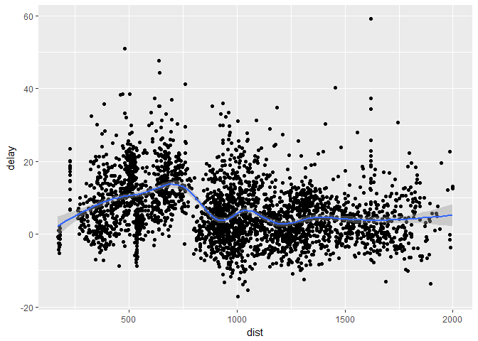

Post01: Data Visualization with dplyr
================
Tianshu Zhao
2017.10.30

**Introduction**
================

" dplyr " is a package used for data manipulation in RStudio, writted and maintenanced by *Handley Wickham* (my 133 God). It provides some powerful, easy-to-use functions that are extremely useful for data exploration and analysis. As a Statistics and applied math senior, I found "dplyr" is my biggest time-saver. From what I can tell, you may not need to know the classification of the various machine leaening and clustering algorithm, but if you use R to analysis data and don't know how to use "dplyr", then it is a huge pity. In this post, I want to focus on the things we have learned from class and it's further extension. Although we have seen most of the function in class, but we are not deeply familiar with it so far.


**Background**
==============

" dplyr " is the upgrade version of "plyr" package, the data can be easily filtered,deformated, summarized, grouped and piped using "dplyr" to perform data processing. It covers 90% of user demand in RStudio.

In data analysis process, the original data set is often uncleaned, unsorted and non-transformed.The Common work for mining and transforing data mainly includes: specific analysis on the record of the selection of variables, meet the conditions of filter, sort by one or several variables, process of original variable and generate a new variable, summarize the data and grouping elements, such as calculating the average and standard deviation of each group.

According to the website of RStudio, the writer of **dplyr**---*Hadley Wickham*(also the writer of **ggplot2** package), he claims himself as *"a grammar of data manipulation"*. He further isolated the **ddply()** functions in the "plyr" package and focused on accepting the **data frame** object, it has greatly increased the speed of data manipulation, and providing a more robust iterface with other database objects.

This project tries to briefly introduce some basic and common functions of **dplyr()** package. In mainly includes:

-   ### Variable filter function---**select**

-   ### Character selection function----**filter**

-   ### Order arrangement function----**arrange**

-   ### Deformation(calculation) function ----**mutate**

-   ### Summary function----**summarize**

-   ### grouping function----**group\_by**

-   ### Multi-step operation concatenations----**%&gt;%**

-   ### Simple random sample function----**sample\_n, sample\_frac**


First, we install the **dplyr** package and use the defalut **nycflight13** data as an example.

``` r
library(dplyr)
```

    ## Warning: package 'dplyr' was built under R version 3.4.2

    ## 
    ## Attaching package: 'dplyr'

    ## The following objects are masked from 'package:stats':
    ## 
    ##     filter, lag

    ## The following objects are masked from 'package:base':
    ## 
    ##     intersect, setdiff, setequal, union

``` r
library(nycflights13)
```

    ## Warning: package 'nycflights13' was built under R version 3.4.2

Please ignore the warning, my R is the newest version, I really have no idea how to fix it 

**Data overview**
=================

Data can sometimes have a lot of rows, and if you print it all at once, it will take a lot of time， you can not see the name of each row as well. So the R language provides us with a **head()** function, also in **dplyr**, there is a implements similar **tbl\_df()** function, displaying the following results. You can see the years, months, days, departure time, schedule arrival time, actual arrive time,delay tme,etc.

Output shows that, "flight" is a data frame, and it contains 336776 rows of data, 19 variables. **head()** function only display the first 6 rows.

``` r
head(flights)
```

    ## # A tibble: 6 x 19
    ##    year month   day dep_time sched_dep_time dep_delay arr_time
    ##   <int> <int> <int>    <int>          <int>     <dbl>    <int>
    ## 1  2013     1     1      517            515         2      830
    ## 2  2013     1     1      533            529         4      850
    ## 3  2013     1     1      542            540         2      923
    ## 4  2013     1     1      544            545        -1     1004
    ## 5  2013     1     1      554            600        -6      812
    ## 6  2013     1     1      554            558        -4      740
    ## # ... with 12 more variables: sched_arr_time <int>, arr_delay <dbl>,
    ## #   carrier <chr>, flight <int>, tailnum <chr>, origin <chr>, dest <chr>,
    ## #   air_time <dbl>, distance <dbl>, hour <dbl>, minute <dbl>,
    ## #   time_hour <dttm>

``` r
# source : local data frame [6 x 19]
tbl_df(flights)
```

    ## # A tibble: 336,776 x 19
    ##     year month   day dep_time sched_dep_time dep_delay arr_time
    ##    <int> <int> <int>    <int>          <int>     <dbl>    <int>
    ##  1  2013     1     1      517            515         2      830
    ##  2  2013     1     1      533            529         4      850
    ##  3  2013     1     1      542            540         2      923
    ##  4  2013     1     1      544            545        -1     1004
    ##  5  2013     1     1      554            600        -6      812
    ##  6  2013     1     1      554            558        -4      740
    ##  7  2013     1     1      555            600        -5      913
    ##  8  2013     1     1      557            600        -3      709
    ##  9  2013     1     1      557            600        -3      838
    ## 10  2013     1     1      558            600        -2      753
    ## # ... with 336,766 more rows, and 12 more variables: sched_arr_time <int>,
    ## #   arr_delay <dbl>, carrier <chr>, flight <int>, tailnum <chr>,
    ## #   origin <chr>, dest <chr>, air_time <dbl>, distance <dbl>, hour <dbl>,
    ## #   minute <dbl>, time_hour <dttm>

``` r
# source : local data frame [336, 776 x 19]
dim(flights)
```

    ## [1] 336776     19

``` r
class(flights)
```

    ## [1] "tbl_df"     "tbl"        "data.frame"

### **Variable filter function**

The feature was previously also implemented using indexes, and dplyr uses the select function to make filtering more convenient.

``` r
select(flights,year,month,day)
```

    ## # A tibble: 336,776 x 3
    ##     year month   day
    ##    <int> <int> <int>
    ##  1  2013     1     1
    ##  2  2013     1     1
    ##  3  2013     1     1
    ##  4  2013     1     1
    ##  5  2013     1     1
    ##  6  2013     1     1
    ##  7  2013     1     1
    ##  8  2013     1     1
    ##  9  2013     1     1
    ## 10  2013     1     1
    ## # ... with 336,766 more rows

``` r
select(flights,year:day)
```

    ## # A tibble: 336,776 x 3
    ##     year month   day
    ##    <int> <int> <int>
    ##  1  2013     1     1
    ##  2  2013     1     1
    ##  3  2013     1     1
    ##  4  2013     1     1
    ##  5  2013     1     1
    ##  6  2013     1     1
    ##  7  2013     1     1
    ##  8  2013     1     1
    ##  9  2013     1     1
    ## 10  2013     1     1
    ## # ... with 336,766 more rows

The 2 codes above represents select the first 3 colomns of data (year,month,day) Besides, we could also use the **distinct** function to filter duplicate rows according to the values of a column.

``` r
distinct(select(flights, origin,dest))
```

    ## # A tibble: 224 x 2
    ##    origin  dest
    ##     <chr> <chr>
    ##  1    EWR   IAH
    ##  2    LGA   IAH
    ##  3    JFK   MIA
    ##  4    JFK   BQN
    ##  5    LGA   ATL
    ##  6    EWR   ORD
    ##  7    EWR   FLL
    ##  8    LGA   IAD
    ##  9    JFK   MCO
    ## 10    LGA   ORD
    ## # ... with 214 more rows

The code above represents the data of all rows that are not identical to the destination combinations.

### **Character selection function**

**filter()** function provides a basic data screening. In the past, we used data.frame to screen the data in the index. For example, we wanted to find the data of January 1 to use Rcode：

``` r
flights[flights$month == 1 & flights$day == 1, ]
```

    ## # A tibble: 842 x 19
    ##     year month   day dep_time sched_dep_time dep_delay arr_time
    ##    <int> <int> <int>    <int>          <int>     <dbl>    <int>
    ##  1  2013     1     1      517            515         2      830
    ##  2  2013     1     1      533            529         4      850
    ##  3  2013     1     1      542            540         2      923
    ##  4  2013     1     1      544            545        -1     1004
    ##  5  2013     1     1      554            600        -6      812
    ##  6  2013     1     1      554            558        -4      740
    ##  7  2013     1     1      555            600        -5      913
    ##  8  2013     1     1      557            600        -3      709
    ##  9  2013     1     1      557            600        -3      838
    ## 10  2013     1     1      558            600        -2      753
    ## # ... with 832 more rows, and 12 more variables: sched_arr_time <int>,
    ## #   arr_delay <dbl>, carrier <chr>, flight <int>, tailnum <chr>,
    ## #   origin <chr>, dest <chr>, air_time <dbl>, distance <dbl>, hour <dbl>,
    ## #   minute <dbl>, time_hour <dttm>

In **dplyr** it provides a filter function that makes it easier to implement the above functionality:

``` r
filter(flights, month == 1, day ==1)
```

    ## # A tibble: 842 x 19
    ##     year month   day dep_time sched_dep_time dep_delay arr_time
    ##    <int> <int> <int>    <int>          <int>     <dbl>    <int>
    ##  1  2013     1     1      517            515         2      830
    ##  2  2013     1     1      533            529         4      850
    ##  3  2013     1     1      542            540         2      923
    ##  4  2013     1     1      544            545        -1     1004
    ##  5  2013     1     1      554            600        -6      812
    ##  6  2013     1     1      554            558        -4      740
    ##  7  2013     1     1      555            600        -5      913
    ##  8  2013     1     1      557            600        -3      709
    ##  9  2013     1     1      557            600        -3      838
    ## 10  2013     1     1      558            600        -2      753
    ## # ... with 832 more rows, and 12 more variables: sched_arr_time <int>,
    ## #   arr_delay <dbl>, carrier <chr>, flight <int>, tailnum <chr>,
    ## #   origin <chr>, dest <chr>, air_time <dbl>, distance <dbl>, hour <dbl>,
    ## #   minute <dbl>, time_hour <dttm>

For example, the statement will often be use :

``` r
filter(flights,month == 1 | month == 2)
```

    ## # A tibble: 51,955 x 19
    ##     year month   day dep_time sched_dep_time dep_delay arr_time
    ##    <int> <int> <int>    <int>          <int>     <dbl>    <int>
    ##  1  2013     1     1      517            515         2      830
    ##  2  2013     1     1      533            529         4      850
    ##  3  2013     1     1      542            540         2      923
    ##  4  2013     1     1      544            545        -1     1004
    ##  5  2013     1     1      554            600        -6      812
    ##  6  2013     1     1      554            558        -4      740
    ##  7  2013     1     1      555            600        -5      913
    ##  8  2013     1     1      557            600        -3      709
    ##  9  2013     1     1      557            600        -3      838
    ## 10  2013     1     1      558            600        -2      753
    ## # ... with 51,945 more rows, and 12 more variables: sched_arr_time <int>,
    ## #   arr_delay <dbl>, carrier <chr>, flight <int>, tailnum <chr>,
    ## #   origin <chr>, dest <chr>, air_time <dbl>, distance <dbl>, hour <dbl>,
    ## #   minute <dbl>, time_hour <dttm>

### **Variable filter function** arranfe

Besides **filter()** function, **dplyr** also provides a **arrange()** function that could help user to reorder the rows.

``` r
arrange(flights, year, month,day)
```

    ## # A tibble: 336,776 x 19
    ##     year month   day dep_time sched_dep_time dep_delay arr_time
    ##    <int> <int> <int>    <int>          <int>     <dbl>    <int>
    ##  1  2013     1     1      517            515         2      830
    ##  2  2013     1     1      533            529         4      850
    ##  3  2013     1     1      542            540         2      923
    ##  4  2013     1     1      544            545        -1     1004
    ##  5  2013     1     1      554            600        -6      812
    ##  6  2013     1     1      554            558        -4      740
    ##  7  2013     1     1      555            600        -5      913
    ##  8  2013     1     1      557            600        -3      709
    ##  9  2013     1     1      557            600        -3      838
    ## 10  2013     1     1      558            600        -2      753
    ## # ... with 336,766 more rows, and 12 more variables: sched_arr_time <int>,
    ## #   arr_delay <dbl>, carrier <chr>, flight <int>, tailnum <chr>,
    ## #   origin <chr>, dest <chr>, air_time <dbl>, distance <dbl>, hour <dbl>,
    ## #   minute <dbl>, time_hour <dttm>

we can also use the **desc** keyword to reduce the flight delays:

``` r
arrange(flights,desc(arr_delay))
```

    ## # A tibble: 336,776 x 19
    ##     year month   day dep_time sched_dep_time dep_delay arr_time
    ##    <int> <int> <int>    <int>          <int>     <dbl>    <int>
    ##  1  2013     1     9      641            900      1301     1242
    ##  2  2013     6    15     1432           1935      1137     1607
    ##  3  2013     1    10     1121           1635      1126     1239
    ##  4  2013     9    20     1139           1845      1014     1457
    ##  5  2013     7    22      845           1600      1005     1044
    ##  6  2013     4    10     1100           1900       960     1342
    ##  7  2013     3    17     2321            810       911      135
    ##  8  2013     7    22     2257            759       898      121
    ##  9  2013    12     5      756           1700       896     1058
    ## 10  2013     5     3     1133           2055       878     1250
    ## # ... with 336,766 more rows, and 12 more variables: sched_arr_time <int>,
    ## #   arr_delay <dbl>, carrier <chr>, flight <int>, tailnum <chr>,
    ## #   origin <chr>, dest <chr>, air_time <dbl>, distance <dbl>, hour <dbl>,
    ## #   minute <dbl>, time_hour <dttm>

### **Deformation(calculation) function** ----**mutate**

In the dplyr package, we can use the **mutate()** function to generate new variales directly from existing data, which is especially useful when using related classes and clustering algorithms.

``` r
mutate(flights, gain = arr_delay - dep_delay,speed = distance/air_time*60)
```

    ## # A tibble: 336,776 x 21
    ##     year month   day dep_time sched_dep_time dep_delay arr_time
    ##    <int> <int> <int>    <int>          <int>     <dbl>    <int>
    ##  1  2013     1     1      517            515         2      830
    ##  2  2013     1     1      533            529         4      850
    ##  3  2013     1     1      542            540         2      923
    ##  4  2013     1     1      544            545        -1     1004
    ##  5  2013     1     1      554            600        -6      812
    ##  6  2013     1     1      554            558        -4      740
    ##  7  2013     1     1      555            600        -5      913
    ##  8  2013     1     1      557            600        -3      709
    ##  9  2013     1     1      557            600        -3      838
    ## 10  2013     1     1      558            600        -2      753
    ## # ... with 336,766 more rows, and 14 more variables: sched_arr_time <int>,
    ## #   arr_delay <dbl>, carrier <chr>, flight <int>, tailnum <chr>,
    ## #   origin <chr>, dest <chr>, air_time <dbl>, distance <dbl>, hour <dbl>,
    ## #   minute <dbl>, time_hour <dttm>, gain <dbl>, speed <dbl>

``` r
# source: local data frame[336,776 x 21]
```

The code above generates 2 new variables and rows of **gain** and **speed**. Gain is equal to the delay time of leaving time minus the time delay of arrival time, and speed is equal to the distance divided by time \* 60. From the ouput, we can see that thses 2 columns have been added to data.frame( the bottom Variable not shown).

Also, we could use **transform()** function to modify the existing function directly to form new rows(variables.) But if you want to keep the new formed rows(variables) only, you can use **transmute()** function.

``` r
transmute(flights,
          gain = arr_delay - dep_delay,
          gain_per_hour = gain / (air_time / 60)
          )
```

    ## # A tibble: 336,776 x 2
    ##     gain gain_per_hour
    ##    <dbl>         <dbl>
    ##  1     9      2.378855
    ##  2    16      4.229075
    ##  3    31     11.625000
    ##  4   -17     -5.573770
    ##  5   -19     -9.827586
    ##  6    16      6.400000
    ##  7    24      9.113924
    ##  8   -11    -12.452830
    ##  9    -5     -2.142857
    ## 10    10      4.347826
    ## # ... with 336,766 more rows

### **Summary function**----**summarize**

In **dplyr** package, we use the **summarize()** function to compile the data. The following code indicates that the average departure time delay is averaged, with the **na.Rm** saying that all rows with missing data are removed.

``` r
summarise(flights, 
          delay = mean(dep_delay,na.rm = TRUE))
```

    ## # A tibble: 1 x 1
    ##      delay
    ##      <dbl>
    ## 1 12.63907

``` r
# souce: local data frme [1x1]
```

Besides, we can also use \*\* sample\_n()\*\* and **sample\_frac()** function to choose data randomly and calculate the exact part of data we want. This is very important, because the data gathering function, we can easily found the target data in the huge mountain. \#\#\# **grouping function**----**group\_by**

``` r
by_tailnum <- group_by(flights, tailnum)
delay <- summarise(by_tailnum,
                   count = n(),
                   dist = mean(distance, na.rm = TRUE),
                   delay = mean(arr_delay, na.rm = TRUE))
delay <- filter(delay,count>20, dist <2000)
delay
```

    ## # A tibble: 2,962 x 4
    ##    tailnum count     dist      delay
    ##      <chr> <int>    <dbl>      <dbl>
    ##  1  N0EGMQ   371 676.1887  9.9829545
    ##  2  N10156   153 757.9477 12.7172414
    ##  3  N102UW    48 535.8750  2.9375000
    ##  4  N103US    46 535.1957 -6.9347826
    ##  5  N104UW    47 535.2553  1.8043478
    ##  6  N10575   289 519.7024 20.6914498
    ##  7  N105UW    45 524.8444 -0.2666667
    ##  8  N107US    41 528.7073 -5.7317073
    ##  9  N108UW    60 534.5000 -1.2500000
    ## 10  N109UW    48 535.8750 -2.5208333
    ## # ... with 2,952 more rows

### **Multi-step operation concatenations**----**%&gt;%**

The pipeline operator in R is \*\* %&gt;% **, and this symbol can link a series of action functions. The pipe operator %&gt;% will connect the different code instructions. The **%&gt;%\*\* symbol will pass the output o the left to the right as the first parameter of the right function. It is useful to use the pipe operator when performing a continuous operations on a data set, which allows you to record the output of each operation not gradually.

``` r
flights2 <- mutate(flights,speed = distance /(air_time/60))
speed <- select(flights2,tailnum,speed)
speed %>%
  group_by(tailnum) %>%
  summarise(count = n(), avg_speed = mean(speed,na.rm = TRUE)) %>%
  arrange(desc(avg_speed))
```

    ## # A tibble: 4,044 x 3
    ##    tailnum count avg_speed
    ##      <chr> <int>     <dbl>
    ##  1  N228UA     1  500.8163
    ##  2  N315AS     1  498.6851
    ##  3  N654UA     1  498.5821
    ##  4  N819AW     1  490.3448
    ##  5  N382HA    26  485.6026
    ##  6  N388HA    36  484.3891
    ##  7  N391HA    21  484.0645
    ##  8  N777UA     1  483.3645
    ##  9  N385HA    28  482.8947
    ## 10  N392HA    13  482.2468
    ## # ... with 4,034 more rows

### **Simple random sample function**----**sample\_n, sample\_frac**

We can use **sample\_n()** function and **sample\_frac()** to take a random sample of rows: use **sample\_n()** for a fixed number, and **sample\_frac()** for a fixed fraction.

``` r
sample_n(flights,10)
```

    ## # A tibble: 10 x 19
    ##     year month   day dep_time sched_dep_time dep_delay arr_time
    ##    <int> <int> <int>    <int>          <int>     <dbl>    <int>
    ##  1  2013     3    12     2011           2015        -4     2258
    ##  2  2013     7     3     1124           1130        -6     1430
    ##  3  2013    12     5      735            740        -5      930
    ##  4  2013     6    26     1940           1900        40     2229
    ##  5  2013     9     5      901            910        -9     1139
    ##  6  2013     7     6      555            602        -7      717
    ##  7  2013     3     4     1533           1540        -7     1806
    ##  8  2013     6    19     2123           2055        28     2229
    ##  9  2013     2     6     1513           1517        -4     1753
    ## 10  2013     6    27     1158           1200        -2     1309
    ## # ... with 12 more variables: sched_arr_time <int>, arr_delay <dbl>,
    ## #   carrier <chr>, flight <int>, tailnum <chr>, origin <chr>, dest <chr>,
    ## #   air_time <dbl>, distance <dbl>, hour <dbl>, minute <dbl>,
    ## #   time_hour <dttm>

``` r
sample_frac(flights,0.01)
```

    ## # A tibble: 3,368 x 19
    ##     year month   day dep_time sched_dep_time dep_delay arr_time
    ##    <int> <int> <int>    <int>          <int>     <dbl>    <int>
    ##  1  2013     7    31     2100           2049        11       19
    ##  2  2013     1     9     1546           1540         6     1816
    ##  3  2013     8     3     1929           1858        31     2216
    ##  4  2013     3    17      817            815         2     1109
    ##  5  2013    12    24     1601           1600         1     1750
    ##  6  2013     5    18     2241           2245        -4     2352
    ##  7  2013     9    10     1205           1205         0     1354
    ##  8  2013     1    17      621            625        -4      738
    ##  9  2013    12    19     1921           1847        34     2150
    ## 10  2013     6    25      901            843        18     1011
    ## # ... with 3,358 more rows, and 12 more variables: sched_arr_time <int>,
    ## #   arr_delay <dbl>, carrier <chr>, flight <int>, tailnum <chr>,
    ## #   origin <chr>, dest <chr>, air_time <dbl>, distance <dbl>, hour <dbl>,
    ## #   minute <dbl>, time_hour <dttm>

use **replace = TRUE** to perform a boostrap sample. we can also weight the sample with the **weight** argument.

### \*\* Using dplyr to analysis the relationship between flight distance and delay time\*\*

Flight delays and cancellation are the case for eveyone who has the needs of travel. Now let using *nycflights13* package to do the statistical analysis of flight data.we briefly studies the correlation between flight distance and delay time.

``` r
disDelay <- function(){
  myFlights <- select(flights,
                      year,month,day,
                      dep_delay,arr_delay,
                      distance,dest)

myFlights <- select(flights,
                      year,month,day,
                      dep_delay,arr_delay,
                      distance,dest)
myFlights

# list the renaming names.
myFlights <- rename(myFlights,destination = dest)
# delete the missing data
myFlights <- filter(myFlights,
                    !is.na(dep_delay),
                    !is.na(arr_delay))
# data arrangment
arrange(myFlights,dep_delay)
arrange(myFlights,desc(dep_delay))
# data calculation : the relationship between flight distance and delay time
be_dest<- group_by(myFlights,destination)# data analysis\
delay <- summarise(be_dest,       # Statistical calculation after grouping data
                   count = n(),   # number of flights
                   dist = mean(distance,na.rm = TRUE),
                   delay = mean(arr_delay, na.rm = TRUE)
                   )
#  remove distrupting data
delay <- filter(delay,count > 20)
return(delay)}
```

now we want to display data with visualized picture

``` r
library("ggplot2")
```

    ## Warning: package 'ggplot2' was built under R version 3.4.2

``` r
delay
```

    ## # A tibble: 2,962 x 4
    ##    tailnum count     dist      delay
    ##      <chr> <int>    <dbl>      <dbl>
    ##  1  N0EGMQ   371 676.1887  9.9829545
    ##  2  N10156   153 757.9477 12.7172414
    ##  3  N102UW    48 535.8750  2.9375000
    ##  4  N103US    46 535.1957 -6.9347826
    ##  5  N104UW    47 535.2553  1.8043478
    ##  6  N10575   289 519.7024 20.6914498
    ##  7  N105UW    45 524.8444 -0.2666667
    ##  8  N107US    41 528.7073 -5.7317073
    ##  9  N108UW    60 534.5000 -1.2500000
    ## 10  N109UW    48 535.8750 -2.5208333
    ## # ... with 2,952 more rows

``` r
ggplot(data = delay) + 
  geom_point(mapping = aes(x = dist, y = delay)) +
  geom_smooth(mapping = aes(x = dist, y = delay))
```

    ## `geom_smooth()` using method = 'gam'

    ## Warning: Removed 1 rows containing non-finite values (stat_smooth).

    ## Warning: Removed 1 rows containing missing values (geom_point).



#### conclusion

From the picture above, we can conclude :

1.  Within 2500 miles, there is certain relationship between the aircraft distance and flight delays. There is basically no correlation bewteen 2500 miles or more distance and flight delay times.

2.  Flight delay times are basically within 20 minutes.

### **Further tools in dplyr that we did not cover in Class**

#### **join function**

When analysis data, we want to get the most efficient way.In **base** function, we could use **merge()** function to combine two data frames together. But when our population size are large, using **merge()**, it often takes ten or more mintues to get the output. Using **join()** in **dplyr** is our best choice now.

Join, like merge, is designed for the types of problems where you would use a **[sql](https://www.w3schools.com/sql/sql_join.asp)** join.

There are 6 types of join in dplyr. \* **inner\_join()** \* **left\_join()** \* **right\_join()** \* **semi\_join()** \* **anti\_join()** \* **full\_join()**

Suppose we have 2 tables A and B


1.  **inner\_join(a,b,by = "x1")**----Merge data, keep all records, all rows.
2.  **left\_join(a,b,by = "x1")** left\_join(a,b,by = "x1")
3.  **right\_join(a,b,by = "x1")**----Adding a matching data set B record to data set A
4.  **semi\_join(a,b,by = "x1")** ---- Merge data, keep all records, all rows.
5.  **anti\_join(a,b,by = "x1")** ---- Data set A does not match the data set B
6.  **full\_join(a,b, by = "x1")** ---- Like merge() function.

Use 2 simple data frames to demonstrate how joins work.

``` r
monitors <- read.table(header=TRUE, text='
  monitorid        lat       long                 
          1  42.467573  -87.810047     
          2  42.049148  -88.273029
          3  39.110539  -90.324080
                       ')

pollutants <- read.table(header=TRUE, text='
  pollutant   duration    monitorid                 
      ozone         1h            1
        so2         1h            1
      ozone         8h            2
        no2         1h            4
                         ')
```

``` r
library(dplyr)

inner_join(pollutants, monitors, by = "monitorid")
```

    ##   pollutant duration monitorid      lat      long
    ## 1     ozone       1h         1 42.46757 -87.81005
    ## 2       so2       1h         1 42.46757 -87.81005
    ## 3     ozone       8h         2 42.04915 -88.27303

``` r
left_join(pollutants, monitors, by = "monitorid")
```

    ##   pollutant duration monitorid      lat      long
    ## 1     ozone       1h         1 42.46757 -87.81005
    ## 2       so2       1h         1 42.46757 -87.81005
    ## 3     ozone       8h         2 42.04915 -88.27303
    ## 4       no2       1h         4       NA        NA

``` r
full_join(pollutants, monitors, by = "monitorid")
```

    ##   pollutant duration monitorid      lat      long
    ## 1     ozone       1h         1 42.46757 -87.81005
    ## 2       so2       1h         1 42.46757 -87.81005
    ## 3     ozone       8h         2 42.04915 -88.27303
    ## 4       no2       1h         4       NA        NA
    ## 5      <NA>     <NA>         3 39.11054 -90.32408

``` r
semi_join(pollutants, monitors, by = "monitorid")
```

    ##   pollutant duration monitorid
    ## 1     ozone       1h         1
    ## 2       so2       1h         1
    ## 3     ozone       8h         2

``` r
anti_join(monitors, pollutants, by = "monitorid")
```

    ##   monitorid      lat      long
    ## 1         3 39.11054 -90.32408

### **Summary**

We have learned most of the function of **dplyr** package in class, and we study the **join()** function today. The example I give is basic, we need to understand how convenient the **dplyr** package is, the more we operate on the data, the more advantages of **dplyr** will be gradually reflected.  \#\#\# **Reference** 1.<https://rpubs.com/NateByers/Merging>
2.<https://cran.r-project.org/web/packages/dplyr/vignettes/dplyr.html>
3.<https://github.com/andrewpbray/working-with-data-in-r/blob/master/working-with-data-in-r.Rmd>
4.<http://www.cnblogs.com/big-face/p/4863001.html>
5.<http://blog.csdn.net/wlt9037/article/details/74420886>
6.<http://www.jianshu.com/p/b2abad66cb01>
7.<https://wenku.baidu.com/view/53dd9590770bf78a64295460.html>
8.<https://www.w3schools.com/sql/sql_ref_sqlserver.asp>
9.<https://cran.r-project.org/web/packages/nycflights13/nycflights13.pdf>
